# Architecture

**Task Management System (TMS)** — a three-role platform where supervisors assign work,
members execute and report on it, peers review each other's output, and a scoring engine
turns all of that activity into a Performance Index and an engagement risk signal.

- **Style:** classic three-tier (SPA → REST API → relational DB), single deployable unit
- **Backend:** Node.js 18+ / Express 4, ESM modules, `mysql2` connection pool
- **Frontend:** React 18 + TypeScript, Vite, React Router 6, Recharts, Axios
- **Database:** MySQL 8 / MariaDB 10.4+, InnoDB, `utf8mb4`
- **Async work:** `node-cron`, in-process by default or a dedicated process (`RUN_SCHEDULER`)
- **State:** stateless API; all state in MySQL and the filesystem (`server/uploads/`)
- **Tests:** `node --test`, 38 tests, no test dependency added
- **Local stack:** `docker compose up -d` — MySQL, schema, API and a Mailpit inbox

---

## 1. System context

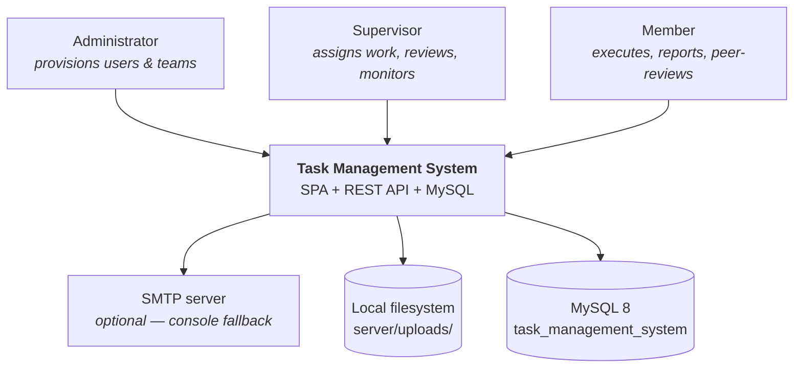

The system has **no external service dependencies** beyond an optional SMTP relay. If SMTP
is unconfigured, `utils/mailer.js` logs the message body to stdout instead — the app is
fully functional offline.

---

## 2. Containers

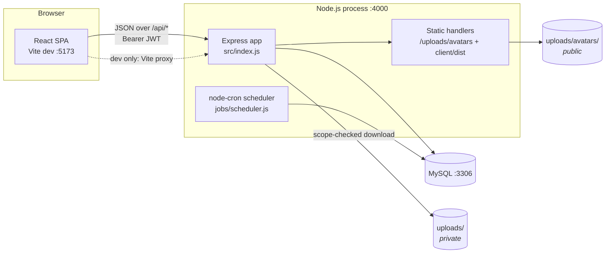

**Two runtime topologies:**

| Mode | Command | Serving |
| --- | --- | --- |
| Development | `npm run dev` | Vite on `:5173` proxies `/api` and `/uploads` to Express on `:4000`; API runs under `node --watch` |
| Production | `npm run build && npm start` | Express on `:4000` serves the API *and* the built SPA from `client/dist` with an SPA fallback for non-`/api` paths |

The production fallback lives in `server/src/index.js:47-54` — it only activates when
`client/dist` exists, so the same entrypoint works in both modes.

---

## 3. Backend component map

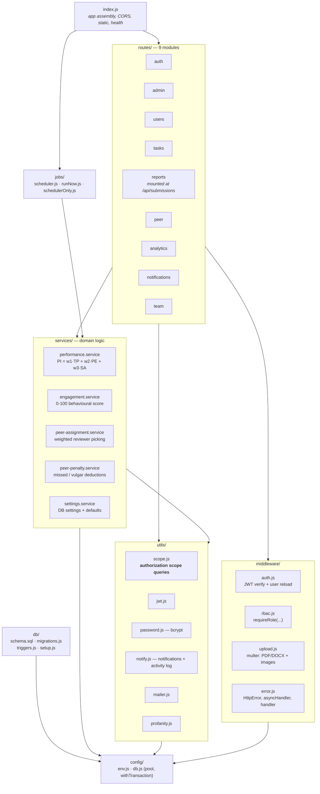

### Layer responsibilities

| Layer | Rule |
| --- | --- |
| `routes/` | HTTP shape, input validation, **authorization scope checks**, orchestration. Talks to the pool directly for simple CRUD. |
| `services/` | Multi-step domain logic that more than one route (or the scheduler) needs. Pure-ish: takes ids and a settings object, returns plain objects. |
| `utils/scope.js` | The single source of truth for "who can see whom". Every supervisor- and peer-scoped query derives its id list from here. |
| `config/db.js` | One shared pool (`connectionLimit: 10`), plus `withTransaction(fn)` for atomic multi-write operations. |
| `middleware/` | Cross-cutting: authentication, role gate, uploads, error translation. |

### Module boundaries worth knowing

- **`reports.routes.js` is mounted at `/api/submissions`**, not `/api/reports`. The file name
  reflects the SRS wording ("reports"); the URL reflects the table (`submissions`).
- **`utils/scope.js` is the authorization kernel.** `memberIdsForSupervisor()` drives the
  review queue, analytics, and every supervisor-scoped list. A bug there is a data-leak bug
  everywhere.
- **Services never import routes.** The dependency graph is strictly one-directional:
  `routes → services → utils → config`.

---

## 4. Frontend component map

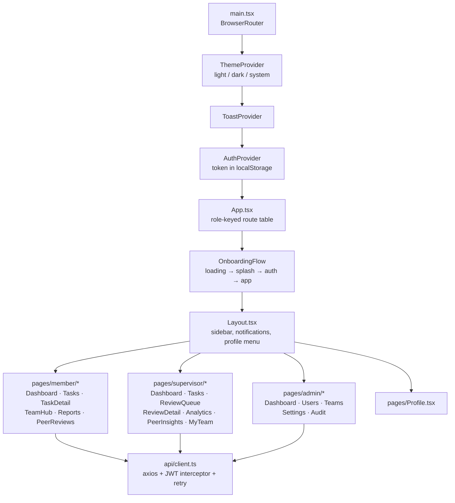

### Routing model

`App.tsx` does not use route guards. Instead it **builds a different route table per role**
(`routesByRole[user.role]`) and renders `<Navigate to="/" replace />` for anything unmatched.
A member literally has no `/analytics` route to navigate to. This is a UX affordance only —
the actual enforcement is `requireRole()` plus per-route scope checks on the server.

### Client-side auth flow

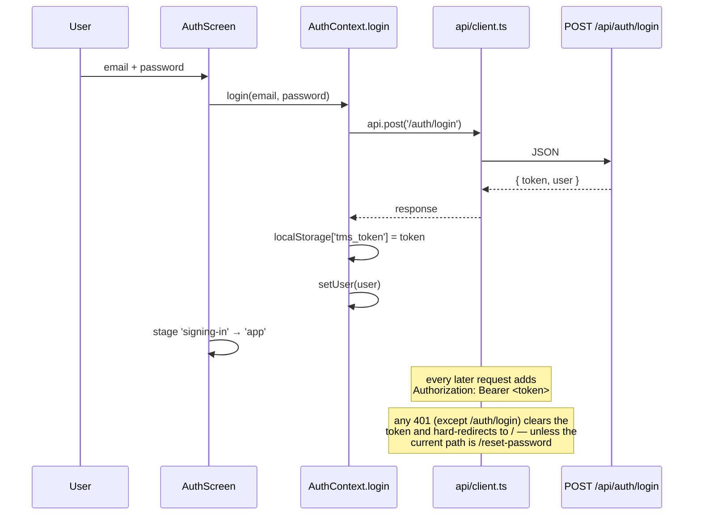

The Axios instance also retries up to **twice** on network errors and 502/503/504 with an
800ms → 1500ms backoff. This exists because `node --watch` restarts the API mid-development
and the Vite proxy returns a synthetic 502 during the gap (`client/vite.config.ts:15-23`).

---

## 5. Request lifecycle

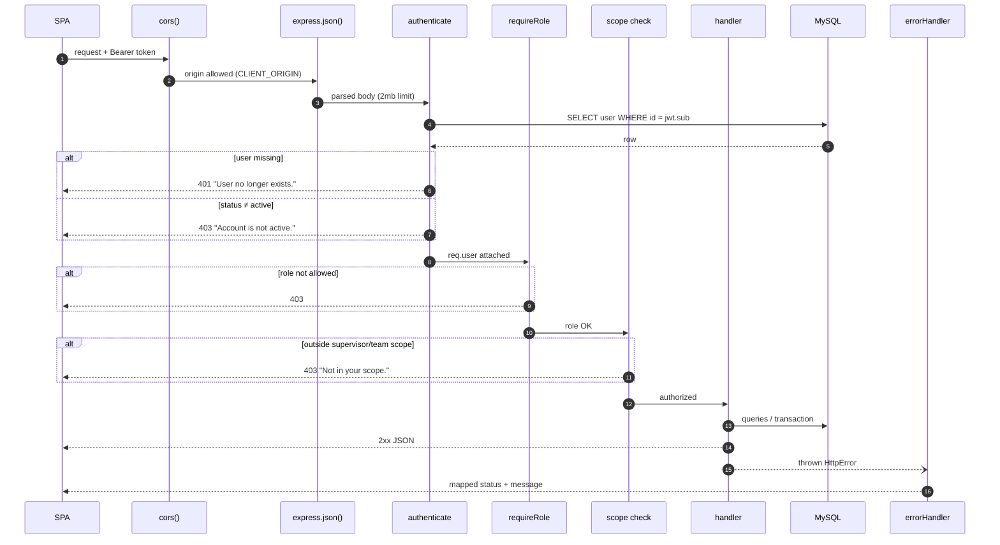

**The JWT is not trusted for authorization.** `middleware/auth.js` re-reads the user row on
every request, so a role change, deactivation, or deletion takes effect immediately rather
than at token expiry. The cost is one extra `SELECT` per request.

---

## 6. Core workflows

### 6.1 Task creation and assignment (UC1)

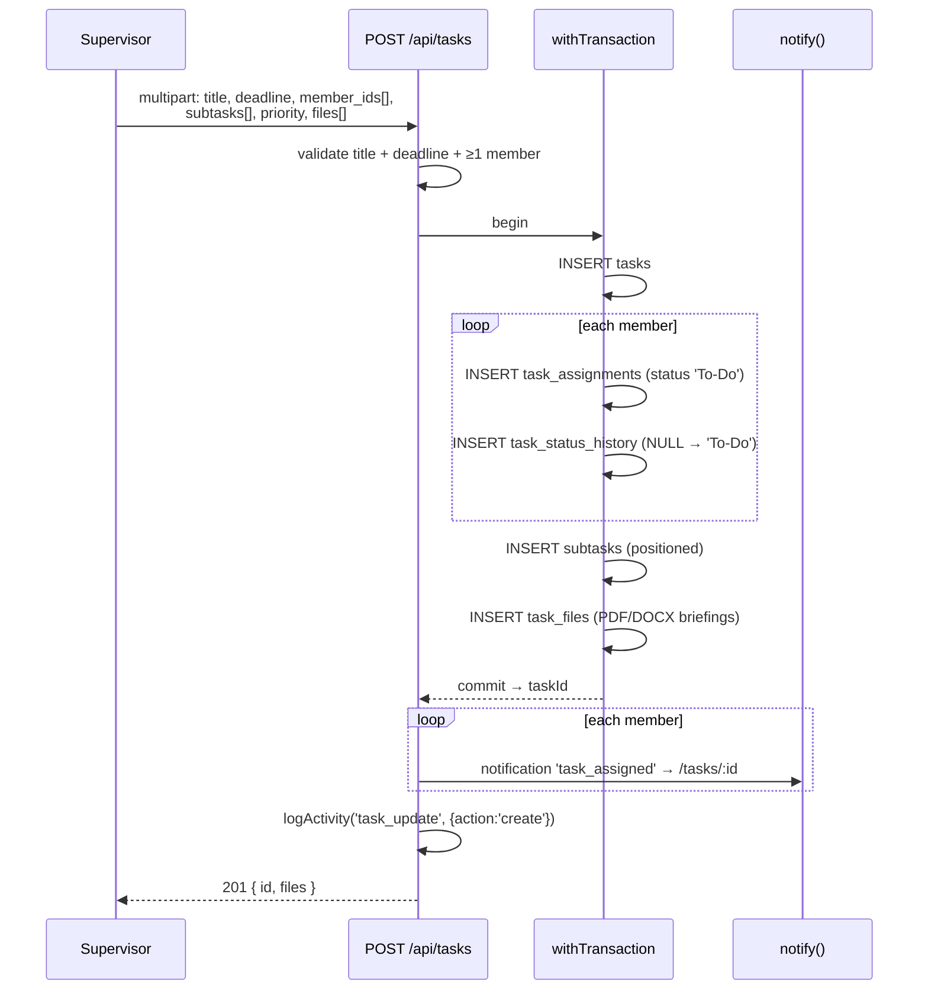

Files are written to disk by multer **before** the transaction runs. A rollback therefore
leaves orphaned files on disk — harmless but not garbage-collected.

### 6.2 Submission → peer assignment → supervisor review (UC4–UC6)

This is the system's central pipeline and touches five tables.

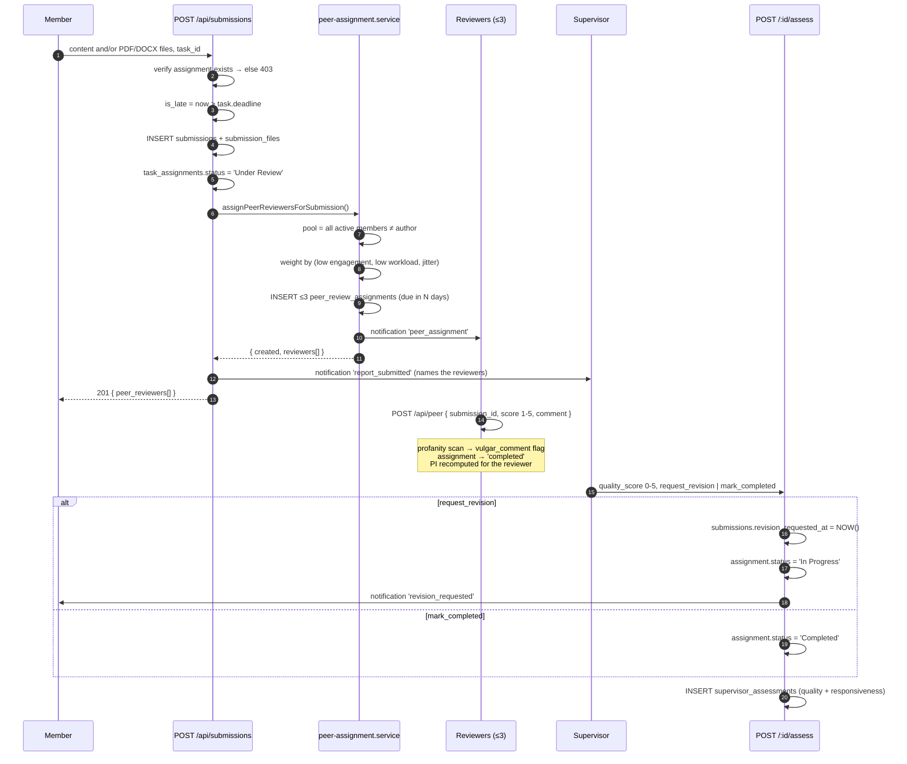

**Peer assignment failure is non-fatal.** The call is wrapped in try/catch
(`reports.routes.js:60-64`); if reviewer selection throws, the submission still succeeds and
the supervisor notification says "No peer reviewers were available to assign."

### 6.3 Task status machine

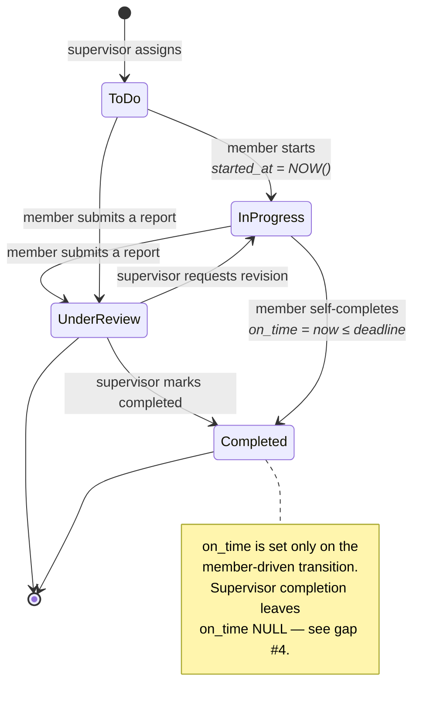

Every transition writes an immutable row to `task_status_history`.

### 6.4 Review-queue classification

The supervisor queue derives a status per submission rather than storing one
(`reports.routes.js:107-114`):

| Queue status | Condition |
| --- | --- |
| `new` | No `supervisor_assessments` row exists yet |
| `pending` | Assessed, `revision_requested_at` set, assignment not `Completed` |
| `completed` | Everything else (approved / done) |

The nav badge (`GET /api/submissions/review-pending-count`, polled every 30s by `Layout.tsx`)
counts `new + pending`.

### 6.5 Nightly scoring job

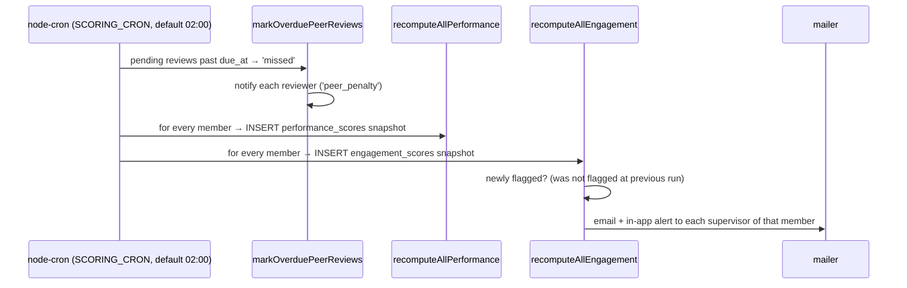

Run it on demand with `npm --prefix server run jobs:run`, or from the UI via
`POST /api/analytics/recompute` (supervisor/admin). The manual runner skips
`markOverduePeerReviews`; the API endpoint and the cron job both include it.

---

## 7. Authorization model

Three enforcement layers, applied in order:

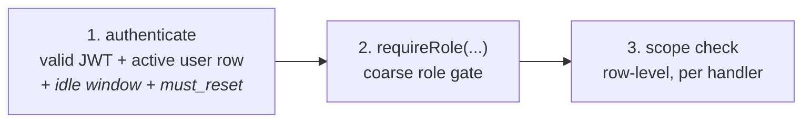

Layer 1 does more than verify a token. On every request it re-reads the user row (so a role
change or deactivation takes effect immediately), rejects a session idle past
`SESSION_IDLE_MINUTES`, and refuses every route but `/auth/me` and `/auth/change-password`
while `must_reset` is set.

**Layer 3 is where the real rules live.** There is no ORM-level tenancy filter; each handler
asks `utils/scope.js` for the ids it may touch:

| Question | Function | Used by |
| --- | --- | --- |
| Which teams does this supervisor own? | `teamIdsForSupervisor` | analytics team filters, `/api/team` |
| Which members does this supervisor see? | `memberIdsForSupervisor` | review queue, analytics, submissions, tasks, members list |
| Who shares a team with this member? | `teammateIds` / `collaborationCohortIds` / `canCollaborateReview` | collaboration ratings, `/api/users/cohort` |

One row-level check lives outside `scope.js`: `canViewSubmissionForPeerReview`
(`services/peer-assignment.service.js`) answers "may this member read this submission?" for
submission detail and file download by non-authors, since it derives from
`peer_review_assignments` rather than the team graph.

### Scope rules by role

| Resource | admin | supervisor | member |
| --- | --- | --- | --- |
| Users / teams / settings / audit | full | none | none |
| Tasks | all | those they created, or with an assignee in their teams | only their own assignments |
| Submissions | all | authored by a member in their teams | their own, plus any they are *assigned* to peer-review |
| Analytics | all members | members in their teams | only `/api/analytics/me` |
| Peer review identity | full attribution | full attribution (`/analytics/peer-reviews`) | **anonymised** — `/api/peer/mine` returns scores and comments with no assessor |

Peer-review anonymity is now **structural**. `peer_assessments` still stores `assessor_id`,
but member-facing handlers read the `peer_assessments_anon` view, which has no such column —
so a careless `SELECT *` cannot de-anonymise a reviewer.

---

## 8. Cross-cutting concerns

### Configuration

`config/env.js` reads `server/.env` through dotenv and normalizes everything into one frozen
shape with defaults. Runtime-tunable values instead live in the `system_settings` table and
are read through `services/settings.service.js`, which merges DB rows over a hard-coded
`DEFAULTS` object — so a missing row never breaks scoring.

| Where | Examples | Changed by |
| --- | --- | --- |
| `.env` (restart required) | ports, DB creds, JWT secret, cron expression, upload limits, SMTP | operator |
| `system_settings` (live) | PI weights, penalty amounts, engagement threshold and weights, review deadline | admin, via `PUT /api/admin/settings` |

### Error handling

`asyncHandler(fn)` wraps every async route so rejections reach the single error middleware.
`errorHandler` (`middleware/error.js`) translates three families:

- **Multer errors** → `413` with a human message ("Each file may be up to 1 GB")
- **Database-down signatures** (`ECONNREFUSED`, `PROTOCOL_CONNECTION_LOST`, `fatal`, or an
  `AggregateError` containing one) → `503` "Database is offline. Start MySQL in XAMPP"
- **Everything else** → `err.status || 500`, logging only 5xx

### Observability

There is no metrics or tracing layer. What exists:

- `login_audit` — every login attempt, success or failure, with IP and user-agent
- `activity_logs` — `login`, `task_update`, `submission`, `comment`, `peer_review`,
  `profile_update`; written fire-and-forget so a logging failure never breaks a request
- `task_status_history` — immutable status transitions
- `GET /api/health` — liveness; `GET /api/admin/health` — row counts, uptime, 24h login stats

### File storage

All uploads — task briefings, submission attachments, and profile avatars — land in one flat
directory (`UPLOAD_DIR`, default `server/uploads/`) named
`<epoch-ms>-<8 random bytes><ext>`. Two access paths exist:

1. **Authorized download** — `GET /api/tasks/:taskId/files/:fileId` and
   `GET /api/submissions/:id/files/:fileId` run scope checks, then `res.download()`.
   The SPA uses these via `downloadFile()` so the JWT header is sent.
2. **Static mount** — `app.use('/uploads', express.static(uploadRoot))`, used for avatars.

Path 2 has **no authentication** — see gap #1.

---

## 9. Data flow summary

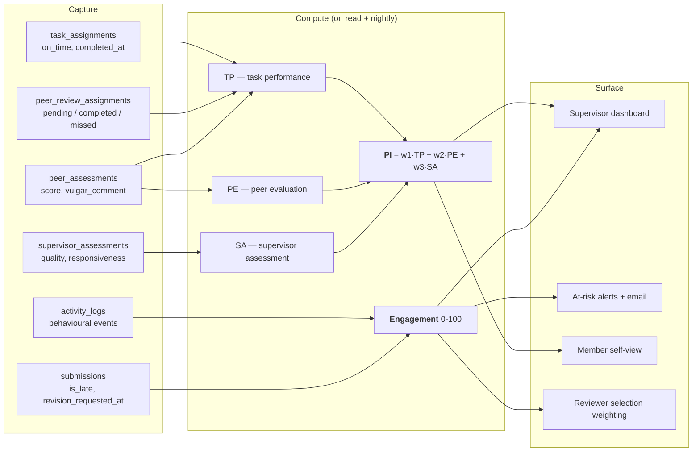

Note the feedback loop: **engagement feeds reviewer selection**, which creates peer-review
obligations, which (if missed) penalise TP, which lowers PI. Full formulas in
[SCORING.md](./SCORING.md).

---

## 10. Deployment

Two supported shapes: the **container stack** (`docker compose`, the default) and a
**host install** (npm on a machine with its own MySQL).

### 10.1 Container stack

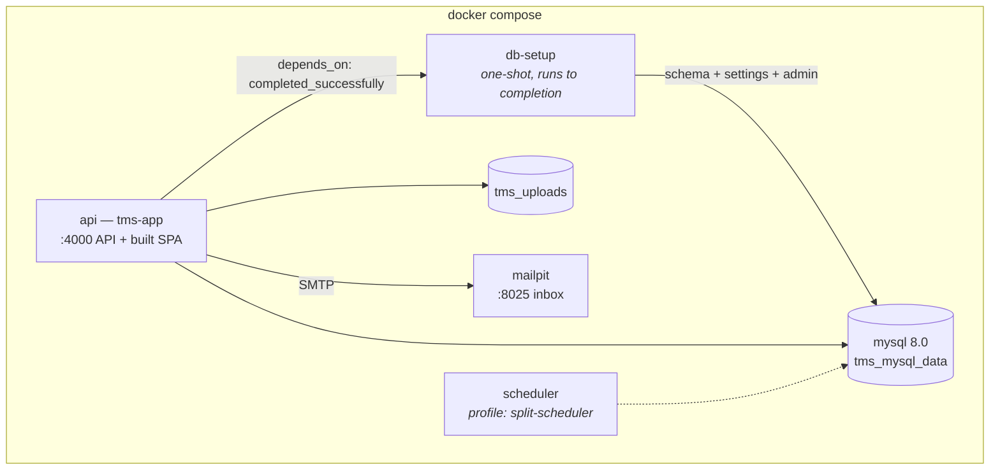

```bash
cp .env.example .env                 # optional — every value has a default
docker compose up -d --build         # mysql → db-setup → api, on :4000
docker compose --profile tools run --rm db-seed    # optional demo dataset
docker compose --profile tools run --rm db-migrate # upgrade an existing volume
docker compose --profile tools up adminer          # DB browser on :8080
docker compose down                  # stop; volumes survive
docker compose down -v               # stop and destroy data
```

`db-setup` is idempotent, so it re-runs harmlessly on every `up` and the API only starts
once it has exited successfully. Password-reset and at-risk emails go to Mailpit at
`http://localhost:8025` rather than the console, which makes those flows testable.

The image is built from the repo root `Dockerfile`: the SPA is compiled in a builder stage
and copied to `/app/client/dist`, preserving the `../../client/dist` path that
`index.js` resolves. `UPLOAD_DIR` is set to the absolute `/app/uploads` so the named volume
is independent of the process working directory.

### 10.2 Host install

```bash
npm run install-all      # root + server + client
cp server/.env.example server/.env
npm run db-setup         # CREATE DATABASE, apply schema.sql, seed settings + admin
npm run db-migrate       # idempotent upgrade for an existing database
npm --prefix server run db:seed   # optional demo dataset
npm run build            # client/dist
npm start                # serves API + SPA on :4000
```

`db/setup.js` is for a fresh database; `db/migrate.js` is idempotent and safe to re-run
against an existing one (it adds columns, recreates `peer_review_assignments` when the old
cycle-based shape is detected, and back-fills settings rows).

### Scaling constraints

The design assumes a **single process**. Three things break under horizontal scaling:

1. **The cron scheduler runs in-process** — N replicas means N nightly scoring runs, each
   inserting duplicate snapshot rows and re-sending at-risk emails. *Partly addressed:*
   `RUN_SCHEDULER=false` disables the in-process cron, and `npm run jobs:scheduler`
   (`jobs/schedulerOnly.js`, exposed as the `split-scheduler` compose profile) runs it as a
   dedicated single process. There is still no leader election, so exactly one such process
   may run.
2. **Uploads go to local disk** — replicas would not see each other's files. The compose
   stack puts them on a shared named volume, which covers replicas on one host but not
   across hosts; object storage is still the real fix.
3. **`connectionLimit: 10`** is per process, so DB connections multiply with replicas.

---

## 11. Resolved issues and remaining constraints

All 31 findings in **[ISSUES.md](./ISSUES.md)** and the eight design findings in
**[DATA-MODEL.md](./DATA-MODEL.md#design-review)** have been fixed and verified. The
architectural subset, and what replaced each:

| # | Was | Now |
| --- | --- | --- |
| 1 | `/uploads` static-served with no auth | Two roots. Only `uploads/avatars/` is public; attachments are reachable only through the scope-checked download routes, and `/uploads/*` no longer falls through to the SPA. |
| 2 | `SESSION_IDLE_MINUTES` read but never used | Enforced from server-side `users.last_seen_at`, throttled to one write a minute. |
| 3 | `must_reset` set but never read | Gated in `middleware/auth.js`; only `/auth/me` and `/auth/change-password` stay reachable. |
| 4 | `on_time` NULL on supervisor completion | Set from the *submission* timestamp, so review latency is not charged to the member. |
| 5 | `performance_scores`, `task_status_history` write-only | Surfaced at `/api/analytics/trend/:id` and `/api/analytics/history/:taskId`. |
| 6 | Analytics looped members × weeks | Set-based aggregates. Overview 66→18 queries, weekly 192→7. |
| 7 | `PATCH /admin/users/:id` unvalidated | Validated against the enums; 400 instead of a raw 500. |
| 8 | Anonymity was query-shape only | `peer_assessments_anon` view has no `assessor_id` column to leak. |
| 9 | Multer files orphaned on rollback | `unlinkUploaded()` on rollback, rejection and task deletion. |
| 10 | Task delete left files on disk | Attachments and briefings are removed with the rows. |
| 11 | `evaluation_cycles` never driven | `currentCycleId()` guarantees one; admin endpoints open and close them; at most one may be open. |
| 12 | `JWT_SECRET` fell back silently | Refuses to start outside development. |

### Constraints that remain by design

1. **The scheduler has no leader election.** `RUN_SCHEDULER=false` plus the dedicated
   `jobs:scheduler` process makes splitting it safe, but nothing enforces that exactly one
   runs. Correct for a single host; not for an autoscaled fleet.
2. **Uploads are local disk.** A shared volume covers replicas on one host, not across hosts.
3. **`connectionLimit: 10`** is per process, so connections still multiply with replicas —
   though P1 cut the demand on that pool substantially.

---

## 11a. Database migrations

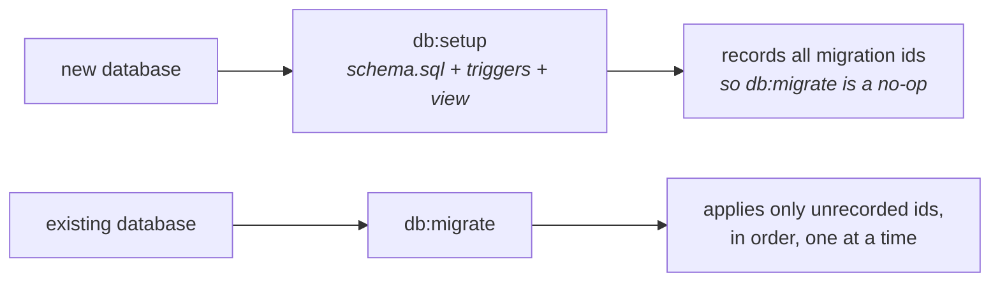

`schema_migrations` records every applied migration id. `db/migrations.js` is append-only:
never edit an id that has shipped, and reflect anything added there in `schema.sql` too. DDL
is not transactional in MySQL, so each `up` is written to be re-runnable — a failure leaves
earlier migrations recorded and the run resumes from the failure point.

Three objects live outside `schema.sql` because of how it is executed:

| Object | Why |
| --- | --- |
| Triggers (`db/triggers.js`) | `setup.js` runs `schema.sql` with `multipleStatements`, which splits on `;` — and a compound trigger body contains its own semicolons. |
| `peer_assessments_anon` view | Declared in `schema.sql`, and re-created by migration `0013` for existing databases. |
| The open evaluation cycle | Seeded by `db:setup`, guaranteed at write time by `currentCycleId()`. |

---

## 11b. Testing

```bash
npm --prefix server test                          # against a reachable MySQL
docker compose --profile tools run --rm test      # against the compose MySQL
```

38 tests under `server/test/`, using the built-in `node --test` — no dependency added.

| Suite | Covers |
| --- | --- |
| `performance.service.test.js` | Every penalty path, the clamping boundaries, the zero-data case, the SCORING.md worked example reproduced exactly, and a **C2 regression test** pinning both the fixed and the old broken behaviour |
| `engagement.service.test.js` | The 14-day cold-start guard, each status band edge, both worked examples |
| `scope.test.js` | The authorization boundaries — a supervisor must not see another team, cohorts exclude inactive members, no self-rating |
| `password.test.js`, `profanity.test.js` | Pure functions; no database needed |

Two design points worth knowing. Each DB-backed file builds **its own database**, because
`node --test` runs files in parallel and a shared one had them dropping each other's schema
mid-run. And availability is resolved with a **top-level await**, because `skip:` is evaluated
when a test is *registered* — before any `before()` hook runs.

The batched and per-member scoring paths are asserted to agree exactly, so the P1 optimisation
cannot silently drift from the reference implementation.

---

## 12. Where to change what

| To change… | Start at |
| --- | --- |
| A scoring formula or weight | `services/performance.service.js`, `services/engagement.service.js`, defaults in `services/settings.service.js` + `db/setup.js` |
| Who can see what | `utils/scope.js`, then the scope checks in the relevant route |
| The reviewer selection algorithm | `services/peer-assignment.service.js` — `reviewerWeight()` and `weightedPick()` |
| Accepted upload types or size | `middleware/upload.js` (`ALLOWED`, `IMAGE_TYPES`) + `MAX_UPLOAD_MB` |
| Navigation or role menus | `client/src/components/Layout.tsx` (`NAV`) and `client/src/App.tsx` (`routesByRole`) |
| Colours, spacing, dark mode | `client/src/styles/theme.css` |
| The onboarding/splash sequence | `client/src/pages/auth/OnboardingFlow.tsx` |
| Database shape | `db/schema.sql` for fresh installs **and** a new numbered migration in `db/migrations.js` for existing ones — both must be updated |
| A trigger | `db/triggers.js`, plus a migration that calls `applyTriggers` |
| Scoring behaviour | The service, **and** the matching test in `server/test/` |
