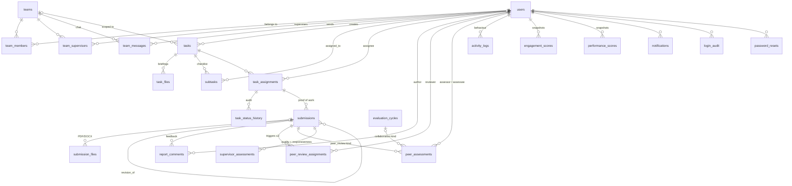

# Data Model

MySQL 8 / MariaDB 10.4+, InnoDB, `utf8mb4_unicode_ci`. Defined in
[`server/src/db/schema.sql`](../server/src/db/schema.sql) and organised into nine functional
modules. All foreign keys are declared; referential integrity is enforced by the database,
not the application.

Two entry points:

- **`db/setup.js`** — creates the database, applies `schema.sql`, seeds `system_settings`
  defaults and the initial admin. For a fresh install.
- **`db/migrate.js`** — idempotent, safe to re-run. Upgrades an existing database in place
  (adds `subtasks.assigned_to`, `users.avatar_url`, `peer_assessments.vulgar_comment`,
  `peer_review_assignments.due_at`, the `missed` status, `team_supervisors`, `task_files`,
  `team_messages`; migrates the old single-supervisor `teams.supervisor_id` column; drops
  the retired `weekly_reports` tables).

> When you change the schema, change **both** files. `schema.sql` covers new installs;
> `migrate.js` covers everything already deployed.

---

## Entity relationships



---

## Module 1 — Identity & access

### `users`

The single account table for all three roles.

| Column | Type | Notes |
| --- | --- | --- |
| `id` | BIGINT UNSIGNED PK | |
| `full_name` | VARCHAR(120) | |
| `email` | VARCHAR(160) | **UNIQUE** — the login identifier |
| `password_hash` | VARCHAR(255) | bcrypt, cost 10 |
| `role` | ENUM | `admin` \| `supervisor` \| `member` |
| `phone`, `title` | VARCHAR | optional profile fields |
| `avatar_color` | VARCHAR(9) | fallback initials-avatar colour, picked from an 8-colour palette at creation |
| `avatar_url` | VARCHAR(255) | `/uploads/<file>` when an image is uploaded |
| `status` | ENUM | `active` \| `inactive` \| `pending`. Anything but `active` blocks authentication at `middleware/auth.js:17` |
| `must_reset` | TINYINT(1) | Set by admin provisioning/reset. **Currently never enforced at login** |
| `created_by` | FK → `users.id` | `ON DELETE SET NULL` |
| `last_login_at` | DATETIME | Updated on each successful login |

Self-referencing FK on `created_by`. Deleting a user cascades to nearly everything they own —
tasks they created, assignments, submissions, comments, assessments in both directions.

### `password_resets`

One row per forgot-password request. `token` is 24 random bytes hex (**UNIQUE**), valid for
one hour, single-use via the `used` flag. The reset endpoint requires
`used = 0 AND expires_at > NOW()`.

### `login_audit`

Every login attempt — success *and* failure — with `email`, `success`, `ip_address`,
`user_agent`, `created_at`. `user_id` is NULL for attempts against unknown emails.
Written after the credentials check but before any response is returned (`auth.routes.js:45`),
so failures are always recorded. Surfaced at
`GET /api/admin/audit` (latest 100) and the admin Security & Audit screen.

---

## Module 2 — Organisation

### `teams`, `team_supervisors`, `team_members`

Both relationships are **many-to-many**:

- A team may have several supervisors (`team_supervisors`, unique on `(team_id, supervisor_id)`)
- A member may belong to several teams (`team_members`, unique on `(team_id, member_id)`)

This pair of join tables *is* the authorization graph. `utils/scope.js` derives every
supervisor's visible member set by joining them:

```sql
SELECT DISTINCT tm.member_id
  FROM team_supervisors ts
  JOIN team_members tm ON tm.team_id = ts.team_id
 WHERE ts.supervisor_id = ?
```

Admin rule: a team must always have **at least one** active supervisor
(`normalizeSupervisorIds`, `admin.routes.js:15`).

### `team_messages`

Lightweight team chat: `team_id`, `sender_id`, `body` (≤2000 chars). Polled by the client
with `?after=<last id>`, capped at 200 rows per fetch. No read receipts, edits, or deletes.

---

## Module 3 — Task management

### `tasks`

Owned by its creator (`created_by`, a supervisor or admin). `team_id` is optional and
`ON DELETE SET NULL`, so deleting a team does not delete its tasks. `priority` is
`Low` \| `Medium` \| `High`; `deadline` is mandatory at the API level (not the schema).

### `task_assignments`

**The unit of work.** One row per `(task_id, member_id)` — unique — because each assignee
tracks their own status independently.

| Column | Meaning |
| --- | --- |
| `status` | `To-Do` \| `In Progress` \| `Under Review` \| `Completed` |
| `started_at` | Stamped on the first `To-Do → In Progress` transition |
| `completed_at` | Stamped on any transition to `Completed` |
| `on_time` | `1` if completed on or before the deadline. **Only set on member-driven completion** — supervisor approval leaves it NULL |

`on_time` and `completed_at` are the raw inputs to the TP half of the Performance Index.

### `task_status_history`

Append-only record of every transition (`old_status`, `new_status`, `changed_by`,
`changed_at`). Written by task creation, member status updates, and re-assignment.
**Currently written but never read** by any endpoint.

### `subtasks`

Optional checklist attached to a task, ordered by `position`. `assigned_to` lets one assignee
subdivide the work and hand a piece to another *assignee of the same task* — enforced in
`tasks.routes.js:377` (`taskAssigneeIds`), not by the schema.

### `task_files`

Briefing documents a supervisor attaches at creation time. Stores both `original_name` (what
the user sees) and `stored_name` (the on-disk `<epoch>-<random>.<ext>`).

---

## Module 4 — Reports & submissions

### `submissions`

A member's proof of work against one assignment.

| Column | Meaning |
| --- | --- |
| `content` | Free-text report body; optional if files are attached |
| `kind` | `daily_log` \| `weekly_report` (default) |
| `is_late` | Computed at insert: `NOW() > task.deadline` |
| `revision_of` | FK → `submissions.id` — links a resubmission to the original |
| `revision_requested_at` | Set on the **original** when a supervisor requests changes |

The `revision_of` / `revision_requested_at` pair drives the responsiveness score: turnaround
is `new.submitted_at − original.revision_requested_at`.

At least one of `content` or a file is required (API-level check). Submitting flips the
parent assignment to `Under Review`.

### `submission_files`

Attachments, `ON DELETE CASCADE` from the submission. Only PDF and DOC/DOCX pass the multer
filter; up to `MAX_UPLOAD_FILES` (default 10) per submission, `MAX_UPLOAD_MB` (default 1024)
each.

---

## Module 5 — Feedback

### `report_comments`

Threaded supervisor feedback on a submission, chronological. Soft-deleted via `deleted_at`
and edit-stamped via `edited_at`; every read filters `deleted_at IS NULL`. Authors may only
edit or delete their own (`affectedRows === 0 → 403`).

---

## Module 6 — Performance monitoring

### `evaluation_cycles`

Named evaluation windows (`start_date`, `end_date`, `status` = `open` \| `closed`). Used only
to scope **collaboration** ratings — the peer route picks the newest `open` cycle. No
endpoint creates or closes cycles; only the seed does. See gap #11 in
[ARCHITECTURE.md](./ARCHITECTURE.md#11-known-gaps-and-technical-debt).

### `peer_assessments`

Both kinds of member-to-member rating share this table, distinguished by `kind`:

| `kind` | Scope | Keyed by | Triggered by |
| --- | --- | --- | --- |
| `peer_review` | Whole active-member pool | `submission_id` | A specific submission the reviewer was assigned |
| `collaboration` | Same-team members only | `cycle_id` | Member-initiated, one per pair per cycle |

| Column | Notes |
| --- | --- |
| `score` | TINYINT with `CHECK (score BETWEEN 1 AND 5)` |
| `comment` | VARCHAR(600), optional |
| `vulgar_comment` | Set by `utils/profanity.js` word-boundary scan at write time. Each flagged comment deducts from the **author's** TP |

Two unique keys enforce one-rating-per-context:
`uq_assessment (cycle_id, assessor_id, assessee_id, kind)` and
`uq_assess_submission (submission_id, assessor_id)`. Both write paths use
`ON DUPLICATE KEY UPDATE`, so re-submitting a review overwrites rather than duplicates.

`assessor_id` is stored but deliberately **never selected** by member-facing endpoints — that
is the whole of the anonymity guarantee.

### `peer_review_assignments`

The obligation, separate from the rating. Created (up to 3) the moment a submission lands.

| Column | Notes |
| --- | --- |
| `status` | `pending` → `completed` (review submitted) or `missed` (past `due_at` when the nightly job runs) |
| `due_at` | `assigned_at + peer_review_deadline_days` (default 7) |
| `kind` | `peer_review` in practice; the `collaboration` value is unused |

Unique on `(submission_id, reviewer_id)`. A `missed` row is a permanent TP deduction for the
reviewer — the count is never reset.

### `supervisor_assessments`

One row per review decision, so a submission can accumulate several over revision rounds.
`quality_score` (0–5) is entered by the supervisor; `responsiveness_score` (0–5) is derived
from revision turnaround (≤24h → 5, ≤48h → 3, else 1) and is NULL when the submission is not
a revision.

### `performance_scores`

Nightly PI snapshots (`tp`, `pe`, `sa`, `pi`, `timeliness`, `penalty_applied`,
`computed_at`). **Written but never read** — every endpoint recomputes live. Useful as a
historical trail if you add trend reporting.

---

## Module 7 — Engagement (ML)

### `activity_logs`

Raw behavioural events, the feature source for the engagement score.

`action_type` ENUM: `login`, `task_update`, `submission`, `comment`, `view`, `peer_review`.
Optional JSON `meta` and `ip_address`.

> ⚠️ `utils/notify.js:logActivity` also writes `'profile_update'` from the profile endpoint,
> which is **not in the enum**. The insert is wrapped in a silent try/catch, so it fails
> quietly under `STRICT_TRANS_TABLES` and is discarded. Either add the value to the enum or
> drop the call.

Indexed on `user_id`, `created_at`, and `action_type` — the three columns every feature query
filters on.

### `engagement_scores`

Snapshots of the computed score: `score` (0–100, NULL when insufficient data), `status`
(`on_track` \| `moderate` \| `at_risk` \| `insufficient_data`), the three feature
sub-scores, and `is_flagged`.

Unlike `performance_scores`, **these are read**:

- `team.routes.js` and `peer-assignment.service.js` join the latest row per member
- `engagement.service.js` compares against the previous row so at-risk emails fire only on a
  *new* flag, not every night

The "latest row" pattern is repeated in three places:

```sql
JOIN (SELECT member_id, MAX(computed_at) mx FROM engagement_scores GROUP BY member_id) last
  ON last.member_id = es.member_id AND last.mx = es.computed_at
```

---

## Module 8 — Notifications

### `notifications`

In-app only (email goes out separately through `utils/mailer.js`). `type` is a free-text
VARCHAR(40) — the values in use are:

`task_assigned` · `subtask_assigned` · `status_update` · `report_submitted` ·
`revision_requested` · `feedback` · `peer_assignment` · `peer_penalty` · `at_risk`

`link` is a client-side route the notification dropdown navigates to. The client polls
`GET /api/notifications` every 30 seconds and marks everything read when the dropdown opens.

---

## Module 9 — System settings

### `system_settings`

Key-value store, `setting_key` UNIQUE. Seeded by `db/setup.js` and merged over hard-coded
defaults by `services/settings.service.js`, so a missing row is never fatal. Values are
coerced to numbers when parseable.

| Key | Default | Effect |
| --- | --- | --- |
| `pi_weight_tp` | 0.25 | PI weight — task performance |
| `pi_weight_pe` | 0.35 | PI weight — peer evaluation |
| `pi_weight_sa` | 0.40 | PI weight — supervisor assessment |
| `peer_penalty` | 0.10 | PE deduction when a member has given zero peer evaluations |
| `peer_review_deadline_days` | 7 | Days a reviewer has before an assignment is `missed` |
| `peer_review_missed_penalty` | 0.05 | TP deduction per missed review |
| `peer_review_bad_penalty` | 0.03 | TP deduction per vulgar comment written |
| `engagement_risk_threshold` | 40 | Below this engagement score → `at_risk` |
| `eng_weight_login` | 0.34 | Engagement weight — login frequency |
| `eng_weight_task` | 0.33 | Engagement weight — task-update frequency |
| `eng_weight_submission` | 0.33 | Engagement weight — submission timeliness |

Editable live at `PUT /api/admin/settings`; the next scoring read picks them up with no
restart. The three PI weights are not validated to sum to 1 — the result is clamped to
`[0, 1]` regardless.

---

## Integrity and indexing notes

**Cascade behaviour.** Deleting a user or a task removes the dependent graph
(`ON DELETE CASCADE` on assignments, submissions, files, assessments, notifications).
Eight foreign keys are `ON DELETE SET NULL` instead, so the referencing row survives its
parent: `tasks.team_id`, `users.created_by`, `login_audit.user_id`,
`peer_assessments.cycle_id`, `performance_scores.cycle_id`, `subtasks.assigned_to`,
`submissions.revision_of`, and `task_status_history.changed_by`.

**Uniqueness invariants.**

| Constraint | Prevents |
| --- | --- |
| `users.uq_users_email` | Duplicate accounts |
| `task_assignments.uq_assignment` | Assigning the same task to a member twice |
| `team_members.uq_team_member`, `team_supervisors.uq_team_supervisor` | Duplicate memberships |
| `peer_assessments.uq_assess_submission` | Two reviews of one submission by one reviewer |
| `peer_review_assignments.uq_pra_submission_reviewer` | Assigning a reviewer twice to one submission |

**Index coverage** follows the actual query shapes: deadline ordering
(`idx_task_deadline`), reviewer work queues (`idx_pra_reviewer (reviewer_id, status)`),
team chat pagination (`idx_msg_team (team_id, id)`), and the three engagement feature filters.

**Dates are strings.** The pool sets `dateStrings: true`, so `DATETIME` columns come back as
`'YYYY-MM-DD HH:MM:SS'` rather than JS `Date` objects. Code that does date math wraps them in
`new Date(...)` explicitly.
