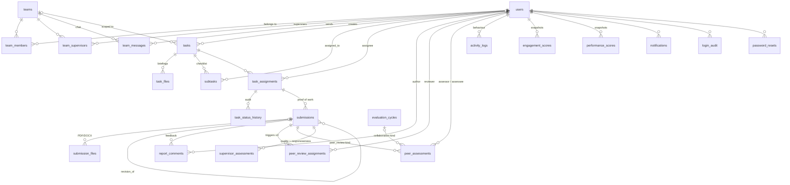

# Data Model

MySQL 8 / MariaDB 10.4+, InnoDB, `utf8mb4_unicode_ci`. Defined in
[`server/src/db/schema.sql`](../server/src/db/schema.sql) and organised into nine functional
modules. All foreign keys are declared; referential integrity is enforced by the database,
not the application.

Two entry points, reconciled by a **migration ledger**:

- **`db/setup.js`** — creates the database, applies `schema.sql`, applies triggers, records
  every migration id as already applied, seeds `system_settings`, ensures an open evaluation
  cycle and the initial admin. For a fresh install.
- **`db/migrate.js`** — applies the numbered migrations in `db/migrations.js` that
  `schema_migrations` does not yet record. Idempotent and resumable.

Because `setup.js` records the full ledger, `db:migrate` against a fresh install is a genuine
no-op rather than a series of redundant `ALTER`s.

> When you change the schema, change **both**: `schema.sql` for new installs, and a new
> **append-only** numbered migration for everything already deployed. Never edit a migration
> id that has shipped.

Three objects live outside `schema.sql`. `setup.js` executes that file with
`multipleStatements`, which splits on `;` — and a compound trigger body contains its own
semicolons, so `db/triggers.js` issues those statements individually.

---

## Entity relationships



---

## Module 1 — Identity & access

### `users`

The single account table for all three roles.

| Column | Type | Notes |
| --- | --- | --- |
| `id` | BIGINT UNSIGNED PK | |
| `full_name` | VARCHAR(120) | |
| `email` | VARCHAR(160) | **UNIQUE** — the login identifier |
| `password_hash` | VARCHAR(255) | bcrypt, cost 10 |
| `role` | ENUM | `admin` \| `supervisor` \| `member` |
| `phone`, `title` | VARCHAR | optional profile fields |
| `avatar_color` | VARCHAR(9) | fallback initials-avatar colour, picked from an 8-colour palette at creation |
| `avatar_url` | VARCHAR(255) | `/uploads/avatars/<file>` — the only publicly served upload path |
| `status` | ENUM | `active` \| `inactive` \| `pending`. Anything but `active` blocks authentication at `middleware/auth.js:17` |
| `must_reset` | TINYINT(1) | Set by admin provisioning/reset. Enforced in `middleware/auth.js`: while set, only `/auth/me` and `/auth/change-password` are reachable |
| `last_seen_at` | DATETIME | Server-side activity stamp backing the idle-session timeout. Written at most once a minute |
| `created_by` | FK → `users.id` | `ON DELETE SET NULL` |
| `last_login_at` | DATETIME | Updated on each successful login |

Self-referencing FK on `created_by`. Deleting a user cascades to nearly everything they own —
tasks they created, assignments, submissions, comments, assessments in both directions.

### `password_resets`

One row per forgot-password request. `token` is 24 random bytes hex (**UNIQUE**), valid for
one hour, single-use via the `used` flag. The reset endpoint requires
`used = 0 AND expires_at > NOW()`.

### `login_audit`

Every login attempt — success *and* failure — with `email`, `success`, `ip_address`,
`user_agent`, `created_at`. `user_id` is NULL for attempts against unknown emails.
Written after the credentials check but before any response is returned (`auth.routes.js:45`),
so failures are always recorded. Surfaced at
`GET /api/admin/audit` (latest 100) and the admin Security & Audit screen.

---

## Module 2 — Organisation

### `teams`, `team_supervisors`, `team_members`

Both relationships are **many-to-many**:

- A team may have several supervisors (`team_supervisors`, unique on `(team_id, supervisor_id)`)
- A member may belong to several teams (`team_members`, unique on `(team_id, member_id)`)

This pair of join tables *is* the authorization graph. `utils/scope.js` derives every
supervisor's visible member set by joining them:

```sql
SELECT DISTINCT tm.member_id
  FROM team_supervisors ts
  JOIN team_members tm ON tm.team_id = ts.team_id
 WHERE ts.supervisor_id = ?
```

Admin rule: a team must always have **at least one** active supervisor
(`normalizeSupervisorIds`, `admin.routes.js:15`).

### `team_messages`

Lightweight team chat: `team_id`, `sender_id`, `body` (≤2000 chars). Polled by the client
with `?after=<last id>`, capped at 200 rows per fetch. No read receipts, edits, or deletes.

---

## Module 3 — Task management

### `tasks`

Owned by its creator (`created_by`, a supervisor or admin). `team_id` is optional and
`ON DELETE SET NULL`, so deleting a team does not delete its tasks. `priority` is
`Low` \| `Medium` \| `High`; `deadline` is mandatory at the API level (not the schema).

### `task_assignments`

**The unit of work.** One row per `(task_id, member_id)` — unique — because each assignee
tracks their own status independently.

| Column | Meaning |
| --- | --- |
| `status` | `To-Do` \| `In Progress` \| `Under Review` \| `Completed` |
| `started_at` | Stamped on the first `To-Do → In Progress` transition |
| `completed_at` | Stamped on any transition to `Completed` |
| `on_time` | `1` if completed on or before the deadline. Set on **both** completion paths; supervisor approval judges against the *submission* timestamp, so review latency is not charged to the member |

`on_time` and `completed_at` are the raw inputs to the TP half of the Performance Index.

### `task_status_history`

Append-only record of every transition (`old_status`, `new_status`, `changed_by`,
`changed_at`), plus denormalised `task_id` and `member_id`.

`assignment_id` is nullable and `ON DELETE SET NULL`, and the denormalised columns mean a row
stays interpretable after its assignment is gone — an audit a routine edit can erase provides
no audit guarantee. Read by `GET /api/analytics/history/:taskId`.

### `subtasks`

Optional checklist attached to a task, ordered by `position`. `assigned_to` lets one assignee
subdivide the work and hand a piece to another *assignee of the same task*.

That rule is enforced by the `trg_subtask_assignee_insert` / `_update` triggers as well as in
the route layer. It cannot be a composite foreign key: `subtasks.task_id` is `NOT NULL`, and
`ON DELETE SET NULL` requires every referencing column to be nullable.

Editing a task's subtasks reconciles by id (update / insert / delete), so `is_done` and
`assigned_to` survive an unrelated edit.

### `task_files`

Briefing documents a supervisor attaches at creation time. Stores both `original_name` (what
the user sees) and `stored_name` (the on-disk `<epoch>-<random>.<ext>`).

---

## Module 4 — Reports & submissions

### `submissions`

A member's proof of work against one assignment.

| Column | Meaning |
| --- | --- |
| `content` | Free-text report body; optional if files are attached |
| `kind` | `daily_log` \| `weekly_report` (default) |
| `is_late` | Computed at insert: `NOW() > task.deadline` |
| `revision_of` | FK → `submissions.id` — links a resubmission to the original |
| `revision_requested_at` | Set on the **original** when a supervisor requests changes |

The `revision_of` / `revision_requested_at` pair drives the responsiveness score: turnaround
is `new.submitted_at − original.revision_requested_at`.

At least one of `content` or a file is required (API-level check). Submitting flips the
parent assignment to `Under Review`.

### `submission_files`

Attachments, `ON DELETE CASCADE` from the submission. Only PDF and DOC/DOCX pass the multer
filter; up to `MAX_UPLOAD_FILES` (default 10) per submission, `MAX_UPLOAD_MB` (default 1024)
each.

---

## Module 5 — Feedback

### `report_comments`

Threaded supervisor feedback on a submission, chronological. Soft-deleted via `deleted_at`
and edit-stamped via `edited_at`; every read filters `deleted_at IS NULL`. Authors may only
edit or delete their own (`affectedRows === 0 → 403`).

---

## Module 6 — Performance monitoring

### `evaluation_cycles`

Named evaluation windows (`start_date`, `end_date`, `status` = `open` \| `closed`), scoping
**collaboration** ratings.

`open_flag` is a generated column (`1` when open, NULL otherwise) carrying a UNIQUE key, so
**at most one cycle may be open** — MySQL has no partial index, and NULLs being distinct is
exactly what makes this work. `currentCycleId()` opens one on demand, and admins manage them
at `GET/POST /api/admin/cycles` and `POST /api/admin/cycles/:id/close`.

### `peer_assessments`

Both kinds of member-to-member rating share this table, distinguished by `kind`:

| `kind` | Scope | Keyed by | Triggered by |
| --- | --- | --- | --- |
| `peer_review` | Whole active-member pool | `submission_id` | A specific submission the reviewer was assigned |
| `collaboration` | Same-team members only | `cycle_id` | Member-initiated, one per pair per cycle |

| Column | Notes |
| --- | --- |
| `score` | TINYINT with `CHECK (score BETWEEN 1 AND 5)` |
| `comment` | VARCHAR(600), optional |
| `vulgar_comment` | Set by `utils/profanity.js` word-boundary scan at write time. Each flagged comment deducts from the **author's** TP |

Two unique keys enforce one-rating-per-context:
`uq_assessment (cycle_id, assessor_id, assessee_id, kind)` and
`uq_assess_submission (submission_id, assessor_id)`. Both write paths use
`ON DUPLICATE KEY UPDATE`, so re-submitting a review overwrites rather than duplicates.

`assessor_id` is stored, but member-facing endpoints read the **`peer_assessments_anon`
view**, which does not expose the column at all. Anonymity is structural rather than a
property of which columns each query happens to select.

`chk_assess_parent` enforces that each kind has exactly one parent — `peer_review` hangs off a
submission with `cycle_id` NULL, `collaboration` off a cycle with `submission_id` NULL. Note
that `cycle_id` stays **nullable** on purpose: making it `NOT NULL DEFAULT 0` would extend
`uq_assessment` to `peer_review` rows and allow a reviewer to review a given member only once
ever, across all submissions.

### `peer_review_assignments`

The obligation, separate from the rating. Created (up to 3) the moment a submission lands.

| Column | Notes |
| --- | --- |
| `status` | `pending` → `completed` (review submitted) or `missed` (past `due_at` when the nightly job runs) |
| `due_at` | `assigned_at + peer_review_deadline_days` (default 7) |

Unique on `(submission_id, reviewer_id)`. A `missed` row is a permanent TP deduction for the
reviewer — the count is never reset. The `kind` column was dropped: only `peer_review` was
ever written.

### `supervisor_assessments`

One row per review decision, so a submission can accumulate several over revision rounds.
`quality_score` (0–5) is entered by the supervisor; `responsiveness_score` (0–5) is derived
from revision turnaround (≤24h → 5, ≤48h → 3, else 1) and is NULL when the submission is not
a revision.

### `performance_scores`

Nightly PI snapshots (`tp`, `pe`, `sa`, `pi`, `timeliness`, `penalty_applied`,
`computed_at`). Read by `GET /api/analytics/trend/:id`, which returns one point per day — the
one view live recomputation cannot produce. The never-written `cycle_id` column was dropped.

---

## Module 7 — Engagement (ML)

### `activity_logs`

Raw behavioural events, the feature source for the engagement score.

`action_type` ENUM: `login`, `task_update`, `submission`, `comment`, `peer_review`,
`profile_update`. Optional JSON `meta` and `ip_address`. The never-written `view` value was
removed.

`logActivity` validates against the exported `ACTIVITY_TYPES` set and warns on both an unknown
type and an insert failure — a logging layer that fails invisibly is worse than one that fails
loudly, which is how `profile_update` went missing for so long.

Indexed by `idx_activity_user_type_created (user_id, action_type, created_at)`: one composite
serving all three engagement feature queries, which filter on all three columns at once.

### `engagement_scores`

Snapshots of the computed score: `score` (0–100, NULL when insufficient data), `status`
(`on_track` \| `moderate` \| `at_risk` \| `insufficient_data`), the three feature
sub-scores, and `is_flagged`.

Unlike `performance_scores`, **these are read**:

- `team.routes.js` and `peer-assignment.service.js` join the latest row per member
- `engagement.service.js` compares against the previous row so at-risk emails fire only on a
  *new* flag, not every night

The "latest row" pattern is repeated in three places:

```sql
JOIN (SELECT member_id, MAX(computed_at) mx FROM engagement_scores GROUP BY member_id) last
  ON last.member_id = es.member_id AND last.mx = es.computed_at
```

---

## Module 8 — Notifications

### `notifications`

In-app only (email goes out separately through `utils/mailer.js`). `type` is a free-text
VARCHAR(40) — the values in use are:

`task_assigned` · `subtask_assigned` · `status_update` · `report_submitted` ·
`revision_requested` · `feedback` · `peer_assignment` · `peer_penalty` · `at_risk`

`link` is a client-side route the notification dropdown navigates to. The client polls
`GET /api/notifications` every 30 seconds and marks everything read when the dropdown opens.

---

## Module 9 — System settings

### `system_settings`

Key-value store, `setting_key` UNIQUE. Seeded by `db/setup.js` and merged over hard-coded
defaults by `services/settings.service.js`, so a missing row is never fatal. Values are
coerced to numbers when parseable.

| Key | Default | Effect |
| --- | --- | --- |
| `pi_weight_tp` | 0.25 | PI weight — task performance |
| `pi_weight_pe` | 0.35 | PI weight — peer evaluation |
| `pi_weight_sa` | 0.40 | PI weight — supervisor assessment |
| `peer_penalty` | 0.10 | PE deduction when a member has given zero peer evaluations |
| `peer_review_deadline_days` | 7 | Days a reviewer has before an assignment is `missed` |
| `peer_review_missed_penalty` | 0.05 | TP deduction per missed review |
| `peer_review_bad_penalty` | 0.03 | TP deduction per vulgar comment written |
| `engagement_risk_threshold` | 40 | Below this engagement score → `at_risk` |
| `eng_weight_login` | 0.34 | Engagement weight — login frequency |
| `eng_weight_task` | 0.33 | Engagement weight — task-update frequency |
| `eng_weight_submission` | 0.33 | Engagement weight — submission timeliness |

Editable live at `PUT /api/admin/settings`; the next scoring read picks them up with no
restart. Each key is validated against a bounds table, and both weight groups (the three PI
weights, the three engagement weights) must sum to **1.000 ±0.001** — checked against the
merged view, so a partial update cannot break the invariant on its own.

---

## Module 10 — Migration ledger

### `schema_migrations`

One row per applied migration id (`db/migrations.js`), so a database can report its own
version. `db:setup` records them all up front; `db:migrate` applies only what is missing.
Append-only: never edit an id that has shipped.

### Views and triggers

| Object | Purpose |
| --- | --- |
| `peer_assessments_anon` | `peer_assessments` without `assessor_id`. Member-facing handlers read this, making anonymity structural (S7). |
| `trg_subtask_assignee_insert` / `_update` | Reject a subtask assigned to someone who is not an assignee of that task. |

---

## Integrity and indexing notes

**Cascade behaviour.** Deleting a user or a task removes the dependent graph
(`ON DELETE CASCADE` on assignments, submissions, files, assessments, notifications).
Eight foreign keys are `ON DELETE SET NULL` instead, so the referencing row survives its
parent: `tasks.team_id`, `users.created_by`, `login_audit.user_id`,
`peer_assessments.cycle_id`, `performance_scores.cycle_id`, `subtasks.assigned_to`,
`submissions.revision_of`, and `task_status_history.changed_by`.

**Uniqueness invariants.**

| Constraint | Prevents |
| --- | --- |
| `users.uq_users_email` | Duplicate accounts |
| `task_assignments.uq_assignment` | Assigning the same task to a member twice |
| `team_members.uq_team_member`, `team_supervisors.uq_team_supervisor` | Duplicate memberships |
| `peer_assessments.uq_assess_submission` | Two reviews of one submission by one reviewer |
| `peer_review_assignments.uq_pra_submission_reviewer` | Assigning a reviewer twice to one submission |

**Index coverage** matches the query shapes throughout. Beyond deadline ordering
(`idx_task_deadline`), reviewer work queues (`idx_pra_reviewer (reviewer_id, status)`) and
team chat pagination (`idx_msg_team (team_id, id)`), three composites were added to match the
multi-predicate analytics filters — a single-column index can only serve one predicate of a
three-predicate query:

| Index | Serves |
| --- | --- |
| `idx_activity_user_type_created (user_id, action_type, created_at)` | all three engagement features |
| `idx_assign_member_status_completed (member_id, status, completed_at)` | the weekly TP aggregate |
| `idx_sub_member_submitted (member_id, submitted_at)` | the 30-day submission window |

**Uniqueness beyond the obvious.** `teams.uq_team_name` prevents duplicate team names, and
`evaluation_cycles.uq_cycle_single_open` — a UNIQUE key over a generated column that is `1`
when open and NULL otherwise — permits many closed cycles but only one open one.

**CHECK constraints** now cover both assessment tables: `chk_assess_score`,
`chk_assess_parent`, `chk_sa_quality`, `chk_sa_responsiveness`. Note `peer_assessments.cycle_id`
is `RESTRICT` rather than `SET NULL`, because MySQL forbids a CHECK on a column carrying a
SET NULL referential action — and nulling it would break the invariant regardless.

**Dates are strings.** The pool sets `dateStrings: true`, so `DATETIME` columns come back as
`'YYYY-MM-DD HH:MM:SS'` rather than JS `Date` objects. Code that does date math wraps them in
`new Date(...)` explicitly.

---

## Design review

> **Status: all eight findings resolved.** The mapping was verified correct — 24 tables (now
> 25 with `schema_migrations`), every `INSERT … (columns)` naming columns that exist, no query
> referencing a missing table, no orphaned table. What follows is the review of the *model
> itself*, with what each finding became.

### 1. Nullable columns doing uniqueness work — **was the one live defect**

`uq_assessment (cycle_id, assessor_id, assessee_id, kind)` enforced nothing while `cycle_id`
was NULL, because MySQL treats NULLs as distinct. No endpoint opened a cycle, so a
`db:setup`-only install was permanently in that state.

> **Resolved — and the obvious fix was a trap.** Making `cycle_id` `NOT NULL DEFAULT 0` (as
> ISSUES.md originally proposed) would have extended the key to `peer_review` rows, permitting
> a reviewer to review a given member **once ever**, across all submissions. Those rows depend
> on `cycle_id` being NULL. Instead the column stays nullable and the rows that need a cycle
> are guaranteed one: `currentCycleId()` opens a cycle on demand, `uq_cycle_single_open`
> ensures there is only ever one, admin endpoints drive the lifecycle, and finding 2's CHECK
> makes a parentless rating unrepresentable. Migration `0004` de-duplicates existing rows.

### 2. `peer_assessments` overloaded two relationships

Both `submission_id` and `cycle_id` nullable, with nothing enforcing exactly one.

> **Resolved.** `chk_assess_parent` requires `peer_review` ⇒ submission + no cycle, and
> `collaboration` ⇒ cycle + no submission. Neither-or-both is now unrepresentable. This also
> surfaced a **seed/application divergence**: `db/seed.js` wrote `peer_review` rows against a
> cycle with no submission — a shape the application never produces — so the seed was
> corrected to hang them off real submissions.

### 3. Denormalised foreign keys (3NF)

`submissions.task_id` / `.member_id`, `peer_review_assignments.reviewee_id`,
`supervisor_assessments.member_id` and `peer_assessments.assessee_id` are all determined by
another key on the same row.

> **Accepted deliberately, and documented.** These are kept so the hot read paths avoid an
> extra join. All write paths derive the redundant value from the same lookup that produced
> the key, so they are consistent by construction — but that is a property of the code, not
> the database. Enforcing it needs a composite foreign key plus a matching unique key on each
> parent; worth doing only if this data ever outlives the application. This is the one finding
> closed by decision rather than by change.

### 4. Constraint asymmetry

> **Resolved.** `chk_sa_quality` and `chk_sa_responsiveness` give `supervisor_assessments` the
> same 0–5 guarantee `peer_assessments` already had. `teams.uq_team_name` makes names unique
> (migration `0007` disambiguates existing duplicates first). Subtask assignees are enforced
> by trigger. `notifications.type` remains free-text `VARCHAR(40)` — it is genuinely open, and
> new notification kinds should not require a migration.

### 5. Index shapes did not match query shapes

> **Resolved.** Three composites replace the single-column indexes they subsume (see
> [index coverage](#integrity-and-indexing-notes)). Paired with P1's batching, the weekly
> endpoint went from ~192 queries to 7.

### 6. The "immutable audit" was not immutable

> **Resolved.** `task_status_history.assignment_id` is nullable and `ON DELETE SET NULL`, and
> `task_id`/`member_id` are denormalised onto the row so an entry stays interpretable after
> its assignment is gone. D1 independently prevents the deletion that used to trigger this.

### 7. Dead schema

> **Resolved.** `performance_scores.cycle_id` and `peer_review_assignments.kind` dropped;
> `activity_logs`' unused `view` enum value removed and `profile_update` added.
> `evaluation_cycles` is no longer dead — it is now driven by admin endpoints and
> `currentCycleId()`.

### 8. Two-file schema maintenance had no ledger

> **Resolved.** `schema_migrations` plus 13 numbered, append-only migrations. A database now
> reports its own version, and `db:migrate` on a fresh `schema.sql` install is a true no-op.

### Summary

| # | Finding | Severity | Outcome |
| --- | --- | --- | --- |
| 1 | Nullable `cycle_id` voided `uq_assessment` | **High** | Fixed — guaranteed cycle + single-open constraint |
| 2 | Assessment parent columns unconstrained | Medium | Fixed — `chk_assess_parent`; seed corrected |
| 3 | Denormalised FKs unenforced (3NF) | Medium | **Accepted by decision**, documented |
| 4 | Inconsistent CHECK / ENUM / UNIQUE coverage | Low–Medium | Fixed — CHECKs, unique team name, triggers |
| 5 | Single-column indexes vs multi-predicate queries | Medium | Fixed — three composites |
| 6 | Audit table cascaded away | Medium | Fixed — nullable FK + denormalised columns |
| 7 | Dead columns and unused enum members | Low | Fixed — dropped |
| 8 | No migration ledger | Low | Fixed — `schema_migrations` + 13 migrations |

**Verified.** `db:migrate` against a `db:setup` database reports "up to date" and changes
nothing; every constraint above was checked by attempting the write it forbids and confirming
the rejection.
