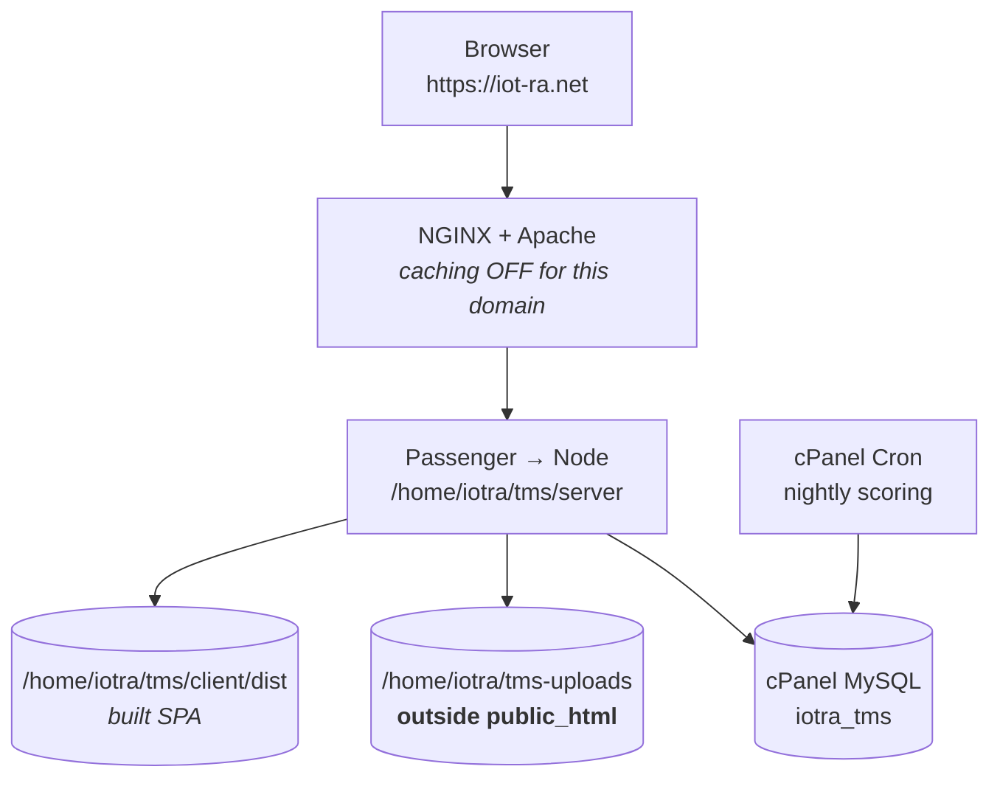

# Deploying to cPanel

Written for the `iotra` account on `iot-ra.net` (shared hosting, `/home/iotra`). Adjust the
account name and domain if yours differ.

> **Docker is not used here.** Shared cPanel hosting gives you neither root nor kernel
> control, so the `docker-compose.yml` in this repository is a *local development and CI*
> tool. On cPanel the app runs natively under Passenger, with cPanel's own MySQL and cron.

cPanel's own walkthrough —
[How to host a Node.js application with cPanel](https://www.cpanel.net/blog/tips-and-tricks/how-to-host-a-node-js-application-with-cpanel/)
— covers the generic Application Manager flow and is worth reading alongside this. It stops at
a hello-world `app.js`; everything below is what this particular application additionally
needs (database, migrations, uploads placement, cron, caching).

---

## 0. What this account has

Confirmed from the panel (cPanel 134.0.49):

| Tool | Where | Used for |
| --- | --- | --- |
| **Application Manager** | Software | Registering the Node app with Passenger. This account has cPanel's own Application Manager, **not** CloudLinux's "Setup Node.js App" — they differ in ways that matter, see below. |
| **Terminal** | Advanced | `npm install`, `db:setup`, `db:migrate`. Essential here, because Application Manager has no "Run JS script" button. |
| **SSH Access** | Security | Same as Terminal, from your own machine |
| **Cron Jobs** | Advanced | The nightly scoring run |
| **phpMyAdmin** / MySQL Databases | Databases | Schema inspection; 1 of 20 databases used |
| **Git™ Version Control** | Files | Optional deploy path |

### Two consequences of it being Application Manager

1. **The startup file must be called `app.js`**, at the application path. cPanel expects that
   name. This repository now ships `server/app.js` for exactly this purpose — a one-line file
   that hands off to the real entry point at `src/index.js`.
2. **There is no "Run NPM Install" or "Run JS script" button.** Application Manager has an
   *Ensure Dependencies* button that runs `npm install`, but schema setup has to happen in
   **Terminal**. That is why Terminal being available matters so much here.

### Still check these two

| Check | Where | What you need |
| --- | --- | --- |
| Node version ≥ 18 | Terminal: `node -v` | The app is ESM. 20 or 22 preferred. If `node` is missing from PATH, see step 6. |
| MySQL/MariaDB version | phpMyAdmin landing page | **MariaDB 10.4+ or MySQL 8+.** Older MariaDB *silently ignores* `CHECK` constraints, which would quietly disable the C1 and score-range protections. |

Two other things from the panel that this guide returns to:

- **NGINX Caching is Active** (there is a *Clear Cache* button beside it) — must be dealt with
  in step 8, or logged-in users can be served each other's cached API responses.
- **Disk: 1.64 GB of 20 GB.** Worth lowering `MEMBER_STORAGE_QUOTA_MB` below the 500 default.

---

## 1. The shape of it on cPanel



Three deliberate choices:

1. **Nothing lives in `public_html`.** Passenger routes the domain to the Node process, which
   serves both the API and the SPA. If the app's files sat in `public_html`, Apache would
   serve them directly and bypass every authorization check in the application.
2. **Uploads live outside the app directory** — see step 8 for why this is the single most
   important line in the whole guide.
3. **The scheduler is a cron job, not in-process.** Passenger idles your app out when there
   is no traffic, so an in-process `node-cron` would simply never fire at 02:00.

---

## 2. Create the database

cPanel → **MySQL® Databases**:

1. **New Database:** `tms` → cPanel creates `iotra_tms`
2. **New User:** `tmsuser` → cPanel creates `iotra_tmsuser`. Use a long generated password
   and keep it; you need it in step 5.
3. **Add User To Database** → grant **ALL PRIVILEGES**

> The app creates triggers and a view. If your host restricts `TRIGGER` or `CREATE VIEW`
> privileges, step 6 will fail with a permissions error — ask support to grant them, or use
> the fallback in step 6b.

cPanel prefixes everything with the account name. The full names are what go in `DB_NAME` and
`DB_USER`.

---

## 3. Get the code onto the server

**Option A — Git (cleanest, and you have it).** cPanel → **Git™ Version Control** → Create,
with repository path `/home/iotra/tms`. Then pull updates from cPanel later.

**Option B — upload.** Zip the repository *without* `node_modules`, `.git`, `client/dist` and
`server/uploads`, upload via File Manager to `/home/iotra/`, extract to `/home/iotra/tms`.

Either way you want:

```
/home/iotra/tms/
├─ server/          ← this is the Node application root
└─ client/          ← only client/dist is needed at runtime
```

---

## 4. Build the SPA locally and upload it

**Build on your machine, not the server.** Shared hosting frequently lacks the memory for a
Vite build, and the build needs devDependencies that the server should not have.

```bash
npm --prefix client install
npm --prefix client run build        # tsc --noEmit && vite build → client/dist
```

Upload the resulting `client/dist` to `/home/iotra/tms/client/dist`.

The server resolves the bundle at `../../client/dist` relative to `server/src`, so this exact
layout matters. If the directory is missing the API still runs — you just get a 404 at `/`
instead of the app, which is a useful way to tell the two problems apart.

---

## 5. Create the Node application

cPanel → **Software** → **Application Manager** → **Register Application**:

| Field | Value |
| --- | --- |
| Deployment Domain | `iot-ra.net` |
| Base Application URL | `/` |
| Application Path | `tms/server` |
| Deployment Environment | **Production** |

> **Application Path is `tms/server`, not `tms`.** That is where `package.json` and `app.js`
> live, so *Ensure Dependencies* finds the manifest and Passenger finds the entry point.
> `client/dist` sits outside the application path, which is fine — the server reads it as a
> plain filesystem path, not as a served directory.

Application Manager will look for **`app.js`** at that path. It is already in the repository:
a one-line ESM file that imports `src/index.js`, so there is a single real entry point and
`npm start`, Docker and local development are unaffected.

Then add the environment variables. This is the part people skip and then spend an hour
debugging:

| Variable | Value | Why |
| --- | --- | --- |
| `NODE_ENV` | `production` | |
| `JWT_SECRET` | *(generate: `openssl rand -hex 32`)* | **The app refuses to start without this.** Deliberate — see below. |
| `DB_HOST` | `localhost` | |
| `DB_NAME` | `iotra_tms` | |
| `DB_USER` | `iotra_tmsuser` | |
| `DB_PASSWORD` | *(from step 2)* | |
| `UPLOAD_DIR` | `/home/iotra/tms-uploads` | **Absolute, outside `public_html`.** See step 8. |
| `CLIENT_ORIGIN` | `https://iot-ra.net` | CORS origin |
| `PUBLIC_URL` | `https://iot-ra.net` | Password-reset links are built from this |
| `RUN_SCHEDULER` | `false` | cron owns the nightly job instead |
| `SESSION_IDLE_MINUTES` | `30` | |
| `MAX_UPLOAD_MB` | `25` | |
| `MEMBER_STORAGE_QUOTA_MB` | `500` | Shared hosting disk is small — consider lowering |
| `SMTP_HOST` | `localhost` | cPanel's local mail server |
| `SMTP_PORT` | `25` | |
| `SMTP_USER` | *(a cPanel email account)* | Leave `SMTP_HOST`/`SMTP_USER` **both** blank to fall back to console logging |
| `SMTP_PASS` | *(its password)* | |
| `MAIL_FROM` | `Task Management System <no-reply@iot-ra.net>` | |
| `SEED_ADMIN_EMAIL` | *(your real address)* | Used once, in step 6 |
| `SEED_ADMIN_PASSWORD` | *(a strong password)* | Used once, in step 6 |

> **On `JWT_SECRET` refusing to boot.** Outside development the app exits rather than start
> with a missing or default signing key, because a deployment that silently signs tokens with
> a key committed to this repository lets anyone with the source mint an admin token. If the
> app will not start, check the log for `[env] JWT_SECRET is missing…` before assuming
> anything else is wrong.

Do **not** set `PORT`. Passenger assigns it.

---

## 6. Install dependencies and build the schema

**Dependencies:** in Application Manager, click **Ensure Dependencies** on your application.
It runs `npm install` against `server/package.json`. Every dependency is pure JavaScript
(`mysql2`, `bcryptjs`, `multer`) — nothing needs a compiler, which is exactly why this works
on shared hosting.

**Schema:** Application Manager has no script runner, so use **Terminal** (Advanced → Terminal,
or SSH):

```bash
cd ~/tms/server

# If `node` is not on PATH, Application Manager's interpreter is under ~/nodevenv.
# Find it, then use the full path in place of `node`/`npm` below:
ls ~/nodevenv/tms/server/

npm install                 # if Ensure Dependencies did not run cleanly
npm run db:setup            # schema + triggers + view + ledger + settings + admin
```

`db:setup` reads `server/.env`, **not** the Application Manager environment variables — those
are injected into the Passenger process only. So create `server/.env` with the same values
before running it:

```bash
cp .env.example .env
nano .env                   # set DB_*, JWT_SECRET, UPLOAD_DIR, SEED_ADMIN_*
```

Then verify the app runs at all, before involving Passenger:

```bash
node app.js                 # should print: [api] listening on http://localhost:4000
# in a second Terminal tab:
curl http://127.0.0.1:4000/api/health
```

If that works and the registered application does not, the problem is Passenger configuration,
not your code — see Troubleshooting.

Optionally run `npm run db:seed` for the demo dataset — but **not on a real deployment**; it
truncates tables and inserts fictional people.

### 6b. If Terminal and SSH are both unavailable

Fallback via phpMyAdmin — more manual, and you must not skip the last two steps:

1. phpMyAdmin → select `iotra_tms` → **Import** → `server/src/db/schema.sql`
2. **Triggers and the view will not import cleanly**, because phpMyAdmin needs `DELIMITER`
   handling for compound trigger bodies. Run the contents of `server/src/db/triggers.js`
   manually in the **SQL** tab, one `CREATE TRIGGER` at a time, with the delimiter set to
   `$$`.
3. Seed `system_settings` — copy the eleven rows from `DEFAULT_SETTINGS` in
   `server/src/db/setup.js`.
4. Record the ledger, or `db:migrate` will later try to re-apply everything:
   ```sql
   INSERT INTO schema_migrations (id) VALUES
     ('0001_legacy_bootstrap'),('0002_activity_log_profile_update'),
     ('0003_analytics_composite_indexes'),('0004_evaluation_cycle_integrity'),
     ('0005_peer_assessment_parent_check'),('0006_score_range_checks'),
     ('0007_unique_team_name'),('0008_audit_survives_assignment_delete'),
     ('0009_drop_dead_schema'),('0010_idle_session_tracking'),
     ('0011_split_avatar_uploads'),('0012_subtask_assignee_triggers'),
     ('0013_peer_anonymity_view');
   ```
5. Open a cycle, or collaboration ratings cannot be written at all:
   ```sql
   INSERT INTO evaluation_cycles (name, start_date, end_date, status)
   VALUES (CONCAT('Cycle ', DATE_FORMAT(CURDATE(), '%Y-%m')), CURDATE(), LAST_DAY(CURDATE()), 'open');
   ```
6. Create the admin. The password column holds a bcrypt hash, which SQL cannot generate —
   produce one locally and paste it in:
   ```bash
   node -e "console.log(require('bcryptjs').hashSync('YOUR-PASSWORD', 10))"
   ```
   ```sql
   INSERT INTO users (full_name, email, password_hash, role, status, avatar_color)
   VALUES ('System Administrator', 'you@example.com', '<paste the hash>', 'admin', 'active', '#7c3aed');
   ```

---

## 7. Schedule the nightly scoring

`RUN_SCHEDULER=false` means the app no longer runs the cron in-process, which is correct here
— Passenger stops an idle application, so an in-process timer is unreliable by design.

Find the node binary first, in Terminal:

```bash
which node || ls ~/nodevenv/tms/server/*/bin/node
```

Use whichever full path that prints.

cPanel → **Cron Jobs**, once per day at 02:00 (`0 2 * * *`):

```bash
cd /home/iotra/tms/server && /home/iotra/nodevenv/tms/server/22/bin/node src/jobs/runNow.js >> /home/iotra/logs/tms-cron.log 2>&1
```

`runNow.js` recomputes performance and engagement and sends at-risk alerts. Note it does
**not** mark overdue peer reviews as missed. To include that — and the retry sweep for
submissions whose reviewer assignment failed — have a supervisor or admin hit
`POST /api/analytics/recompute` instead, or add a second cron calling that endpoint with a
token.

Create `/home/iotra/logs/` first, and check the log after the first run.

---

## 8. Uploads, NGINX caching, and HTTPS

### Uploads — read this one carefully

```bash
mkdir -p /home/iotra/tms-uploads/avatars
```

`UPLOAD_DIR` **must** point outside `public_html`. On cPanel, Apache serves `public_html`
directly, so if uploads lived there, every submission attachment would be downloadable by
anyone who learned a filename — with Express, and every scope check in it, never consulted.

That is precisely the vulnerability this codebase just fixed (S1). Putting uploads in
`public_html` silently undoes it.

The application serves profile images itself, from `UPLOAD_DIR/avatars`, at
`/uploads/avatars/<file>`. Everything else in `UPLOAD_DIR` is reachable only through the
scope-checked download routes.

### NGINX caching

Your cPanel shows **NGINX Caching: Active**. For a static site that is a win; for an
authenticated JSON API it is a correctness and privacy bug — cached `/api` responses can be
served to the wrong user.

Either **turn NGINX caching off for this domain**, or configure it to exclude `/api`. If your
cPanel exposes no exclusion controls, turn it off; the app is not static.

### HTTPS

Your SSL certificate is already Active. Force HTTPS (cPanel → **Domains** → *Force HTTPS
Redirect*), and make sure `CLIENT_ORIGIN` and `PUBLIC_URL` both use `https://`. A mismatch
here breaks CORS and produces password-reset links pointing at the wrong scheme.

---

## 9. Verify

```
https://iot-ra.net/api/health      →  {"status":"ok","time":"…"}
https://iot-ra.net/                →  the app loads
```

Then, in the browser:

1. Log in as the admin from step 6.
2. **Admin → Users** — create a member. The password must be 12+ characters and not a common
   one; the error message names the rule if it fails.
3. Sign in as that member. You should hit the **forced password change** screen — that is
   `must_reset` working.
4. **Forgot password** on the login screen, then check the mailbox. The link must point at
   `https://iot-ra.net`, and must contain no raw token beside it.
5. Fetch a submission attachment's `stored_name` from phpMyAdmin and try
   `https://iot-ra.net/uploads/<that name>` in a private window. **It must 404.** If it
   returns the file, `UPLOAD_DIR` is inside `public_html` — go back to step 8.

Test 5 is the one to actually perform. The others fail loudly; that one fails silently.

---

## 10. Deploying an update later

```bash
# locally
npm --prefix client run build
```

1. Pull or upload the new code.
2. Upload the new `client/dist`.
3. **Run NPM Install** if dependencies changed.
4. **Run JS script → `db:migrate`** if the schema changed. It applies only migrations that
   `schema_migrations` does not already record, so it is safe to run every time and costs
   nothing when there is nothing to do.
5. **Restart** the application in Setup Node.js App.

Never edit a migration id that has already shipped — add a new one.

---

## 11. Troubleshooting

| Symptom | Cause |
| --- | --- |
| App will not start, log shows `[env] JWT_SECRET is missing…` | `JWT_SECRET` unset in Application Manager's environment variables. Deliberate refusal, not a crash. |
| `ERR_REQUIRE_ESM` on startup | Passenger loaded the ESM `app.js` with `require()`. Add `PassengerStartupFile passenger.cjs` to the `.htaccess` in the domain's document root — `server/passenger.cjs` is a CommonJS shim that dynamic-imports the real entry. Both entry points are verified to boot the app. |
| `node: command not found` in Terminal | Node lives under `~/nodevenv/…/bin`. Use the full path, or `source ~/nodevenv/tms/server/<version>/bin/activate` first. |
| `db:setup` fails on triggers or the view | The database user lacks `TRIGGER` or `CREATE VIEW`. Grant ALL PRIVILEGES (step 2) or use 6b. |
| `db:setup` connects to the wrong database | It reads `server/.env`, not Application Manager's environment variables — those reach the Passenger process only. Create `server/.env` too. |
| 503 / "Application failed to start" | Check the log in Setup Node.js App. Usually the DB credentials or a missing `npm install`. |
| App loads but `/` is a 404 while `/api/health` works | `client/dist` was not uploaded, or is in the wrong place. |
| `Database is offline…` on every request | `DB_HOST` should be `localhost`; check `DB_USER` carries the `iotra_` prefix and is attached to the database. |
| Logged-in users see each other's data | NGINX caching on `/api`. Step 8. |
| Attachments downloadable without logging in | `UPLOAD_DIR` is inside `public_html`. Step 8. |
| Collaboration ratings rejected | No open evaluation cycle. Admin → open one, or check step 6b item 5. |
| `CHECK` constraints not enforced | MariaDB older than 10.2. Check step 0. |
| Nightly scores never update | Cron not running, or the wrong node path. Check `/home/iotra/logs/tms-cron.log`. |
| Sessions drop after 30 minutes | Working as designed (`SESSION_IDLE_MINUTES`). Raise it if you want longer. |

### Where the logs are

- **Application:** Setup Node.js App shows the log path, typically
  `/home/iotra/logs/<app>.log`
- **Cron:** wherever you redirected it in step 7
- **In-app:** Admin → **Security & Audit** for login attempts; `GET /api/admin/health` for row
  counts and 24-hour login statistics

---

## 12. If Application Manager is missing or disabled

There is no way to run this application on that plan. The realistic options:

| Option | Notes |
| --- | --- |
| Ask your host to enable Application Manager or the Node.js Selector | Often just a support ticket |
| Upgrade to a plan that includes it | Cheapest path if the host offers it |
| Move to a VPS with root | You could then run the `docker-compose.yml` in this repository directly, which is the closest thing to the verified local environment |
| Any Node-native host | Render, Railway, Fly.io and similar run the Dockerfile as-is |

What you cannot do is run it under PHP, or as static files — the SPA is only the front half,
and every authorization rule lives in the Node API.
