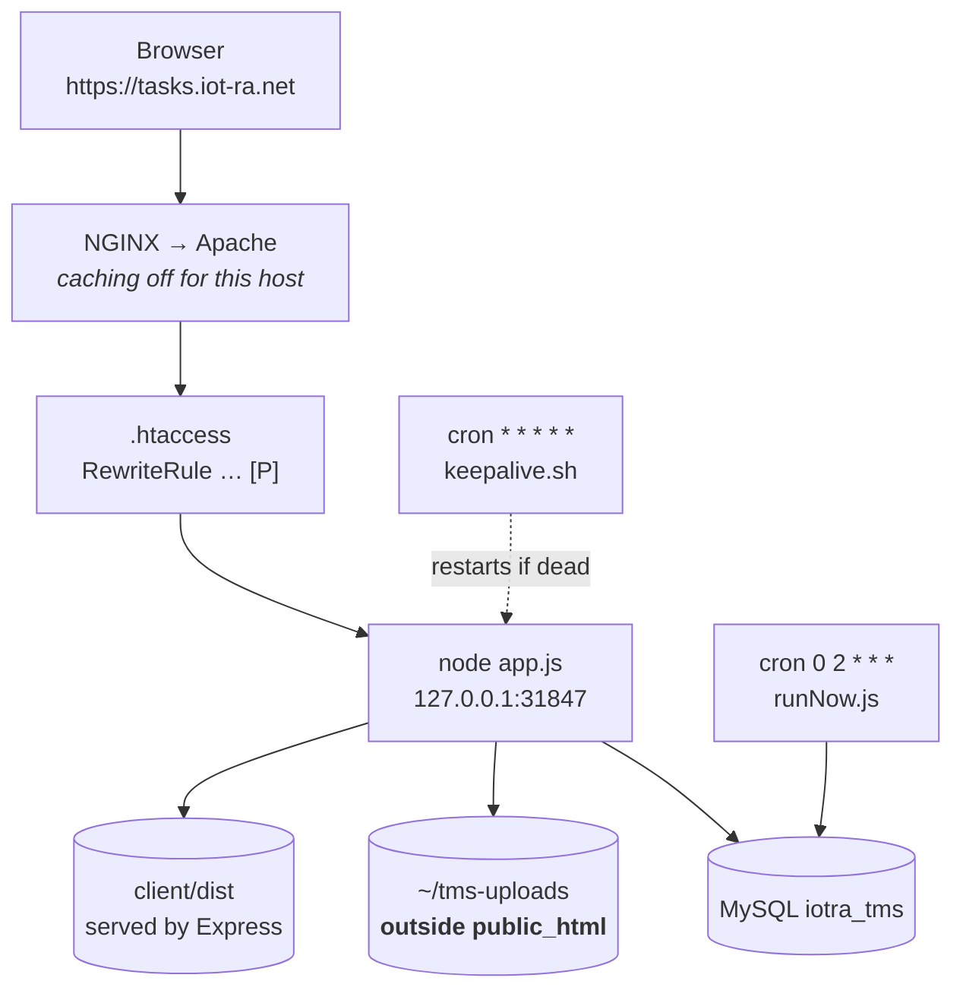

# Deploying to cPanel

How this application is deployed on the `iotra` cPanel account at `tasks.iot-ra.net`, why it
is deployed **that particular way**, and what should replace it.

This is a record of an actual deployment, not an idealised guide. The straightforward route —
cPanel's Application Manager — does not work on this server, and the reasons are documented
below so nobody repeats the investigation.

> **Docker is not used here.** Shared cPanel hosting gives neither root nor kernel control, so
> the `docker-compose.yml` in this repository is a local development and CI tool. It remains
> the reference environment: the test suite and every verified fix run against it.

---

## 1. Current state

| | |
| --- | --- |
| **URL** | `https://tasks.iot-ra.net` |
| **Serving** | Node process on `127.0.0.1:31847`, reverse-proxied by Apache |
| **Application root** | `/home/iotra/tms/server` |
| **Built SPA** | `/home/iotra/tms/client/dist` |
| **Uploads** | `/home/iotra/tms-uploads` (outside `public_html`) |
| **Database** | `iotra_tms`, user `iotra_tmsuser` |
| **Node** | v22.23.2 via **nvm**, at `/home/iotra/.nvm/versions/node/v22.23.2/bin/node` |
| **Process supervision** | `~/tms/keepalive.sh`, run by cron every minute |
| **Deployment branch** | `production` |

**This is a workaround, not the intended architecture.** See [§4](#4-why-not-passenger) for
why, and [§8](#8-future-plans) for what should replace it.

---

## 2. The environment as found

Established by inspection. Several of these were surprises, and each shaped the outcome:

| Fact | Consequence |
| --- | --- |
| Shared hosting (shared IP, no root) | Docker impossible |
| cPanel 134.0.49 with **Application Manager** — not CloudLinux's "Setup Node.js App" | Startup file must be `app.js`; no "Run JS script" button |
| **Terminal and SSH available** | Schema setup possible at all — Application Manager has no script runner |
| Passenger 6.1.5 present (`/etc/apache2/conf.d/passenger.conf`, `ea-ruby27`) | Node hosting looked viable |
| **No `ea-nodejs*` package installed, at any version** | The blocker — see §4 |
| Node v14.21.3 on PATH from a pre-existing **nvm** install | Too old (`??=` needs 15+), but nvm made upgrading trivial |
| `iot-ra.net` already runs a **Laravel site** (`public_html/iot_website/public`) | The app must never be mounted at the domain root |
| A `smarthive.iot-ra.net` subdomain already exists | Subdomain-per-app is the established pattern here |
| NGINX caching **Active** | Must be disabled for this host — §5.7 |
| 20 GB account | `MEMBER_STORAGE_QUOTA_MB` lowered from 500 to 300 |

The Laravel discovery mattered most: mounting at `iot-ra.net` would have taken a live site
offline. `~/public_html/.htaccess` rewrites everything into `iot_website/public`, which is why
early requests to `/api/health` returned Laravel's styled 404 rather than anything of ours.

---

## 3. Architecture



Four deliberate choices:

1. **A subdomain**, not the domain root — the Laravel site keeps `iot-ra.net`.
2. **Application code outside the document root.** `~/tms/server` is not web-served; only the
   proxy rule under `~/public_html/tasks.iot-ra.net/` is exposed. Apache never serves source.
3. **Uploads outside `public_html`.** Apache serves `public_html` directly, so uploads placed
   there would be downloadable by anyone who learned a filename — with Express, and every
   scope check in it, never consulted. That is precisely the vulnerability
   [S1](./ISSUES.md#s1--uploads-is-served-with-no-authentication--high) fixed; the wrong
   directory silently undoes it.
4. **Scoring runs from cron, not in-process** (`RUN_SCHEDULER=false`). The keepalive may
   restart the app at any time, so an in-process timer is not a dependable way to run a
   nightly job.

---

## 4. Why not Passenger

Application Manager is the supported way to run Node on cPanel, and it was tried first. It
fails on this server, conclusively:

```
/bin/sh: /opt/cpanel/ea-nodejs10/bin/node: No such file or directory
```

Passenger itself starts correctly, then fails during "preparation work" trying to execute a
Node binary that does not exist. `ls /opt/cpanel/` shows PHP 5.6–8.5 and `ea-ruby27` — **no
`ea-nodejs` package at all**. The host provisioned Application Manager and `mod_passenger`
without ever installing a Node runtime.

Setting the interpreter explicitly does not help:

```apache
PassengerNodejs /home/iotra/.nvm/versions/node/v22.23.2/bin/node
```

`.htaccess` **is** read — `PassengerEnabled` and `PassengerAppRoot` from the same file take
effect, which is how Passenger gets far enough to fail in the first place. But
`PassengerNodejs` is overridden by the vhost configuration Application Manager writes when
registering an application, and `.htaccess` cannot override a vhost-level directive.

Passenger is therefore unusable here until the host installs `ea-nodejs`. Hence the proxy.

### Problems solved along the way

Each of these cost time and none had an obvious cause:

| Symptom | Cause |
| --- | --- |
| `SyntaxError: Unexpected token '??='` | Node 14 on PATH. `node-cron` uses logical nullish assignment (Node 15+). Fixed with `nvm install 22` |
| `Access denied for user … (using password: YES)` | A `#` in the generated database password started a comment in `.env`. Quote it: `DB_PASSWORD='…'` |
| `Permission denied … Passengerfile.json` | `/home/iotra/tms` was `0700`, so Apache could not traverse it. `chmod 711`. The file did not exist either — the traversal failure masked a plain "not found" |
| Styled dark 404 on `/api/health` | Laravel's 404 page. The parent `public_html/.htaccess` rewrite captured subdomain requests. Fixed with `RewriteEngine Off` in the subdomain's own `.htaccess` |
| Apache 500 (not Passenger's) | `echo >>` appended onto an unterminated final line, producing `…/bin/nodePassengerFriendlyErrorPages on`. Use `printf '%s\n'` |

### Code changes cPanel required

All committed to `production`:

| Change | Why |
| --- | --- |
| `server/app.js` | Application Manager requires the startup file to be named `app.js`. One line, handing off to `src/index.js`, so there is still a single real entry point |
| `server/passenger.cjs` | CommonJS fallback — some Passenger builds `require()` the startup file, throwing `ERR_REQUIRE_ESM` against this ESM server. Unused under the proxy setup; kept for when Passenger works |
| `config/env.js` loads `.env` **by module path** | Application servers do not guarantee cwd is the app root. A silently unloaded `.env` makes `JWT_SECRET` look unset, the production guard exits, and the only symptom is "could not be started" |
| `db/setup.js` tolerates a pre-existing database | Managed MySQL issues per-database users with no `CREATE DATABASE` privilege. It now connects to the target database first and only creates one on `ER_BAD_DB_ERROR` |

---

## 5. Setup, from scratch

### 5.1 Database

cPanel → **Database Wizard**: database `tms` → `iotra_tms`; user `tmsuser` → `iotra_tmsuser`;
grant **ALL PRIVILEGES**. `TRIGGER` and `CREATE VIEW` are both genuinely needed — the schema
creates two triggers and the `peer_assessments_anon` view.

### 5.2 Node

```bash
source ~/.nvm/nvm.sh
nvm install 22
nvm alias default 22
node -v                      # v22.x — 18 is the minimum
```

### 5.3 Code

```bash
cd ~ && git clone -b production https://github.com/makmot256/TASK-MANAGEMENT-SYSTEM.git tms
chmod 711 ~/tms              # Apache traversal; 0700 breaks it
```

The SPA build is **not** in the repository (`dist/` is correctly gitignored). Build locally and
upload `client/dist` to `/home/iotra/tms/client/dist`:

```bash
npm --prefix client install && npm --prefix client run build
```

Confirm `~/tms/client/dist/index.html` exists. Without it the API works but `/` returns 404 —
a useful way to tell the two failures apart.

### 5.4 Configuration

```bash
mkdir -p ~/tms-uploads/avatars ~/logs
cd ~/tms/server
cp .env.example .env
nano .env
chmod 600 .env               # holds the database password
```

```ini
NODE_ENV=production
PORT=31847
CLIENT_ORIGIN=https://tasks.iot-ra.net
PUBLIC_URL=https://tasks.iot-ra.net
DB_HOST=localhost
DB_NAME=iotra_tms
DB_USER=iotra_tmsuser
DB_PASSWORD='…'              # quote it — an unquoted # starts a comment
JWT_SECRET=…                 # openssl rand -hex 32
UPLOAD_DIR=/home/iotra/tms-uploads
MEMBER_STORAGE_QUOTA_MB=300
RUN_SCHEDULER=false
SEED_ADMIN_EMAIL=…
SEED_ADMIN_PASSWORD=…        # 12+ chars; this becomes the first admin login
```

### 5.5 Install and build the schema

```bash
npm install
npm run db:setup             # schema, triggers, view, ledger, settings, admin
node app.js                  # sanity check: [api] listening on …:31847
```

`db:setup` hashes `SEED_ADMIN_PASSWORD` directly, bypassing the 12-character policy the rest
of the application enforces. If a weak one was used, force a change on first login:

```sql
UPDATE users SET must_reset = 1 WHERE email = 'you@example.com';
```

### 5.6 Proxy and supervision

```bash
cat > ~/tms/keepalive.sh <<'EOF'
#!/bin/bash
export PATH="$HOME/.nvm/versions/node/v22.23.2/bin:$PATH"
cd "$HOME/tms/server" || exit 1
pgrep -f "node .*tms/server/app\.js" >/dev/null && exit 0
nohup node app.js >> "$HOME/logs/tms-app.log" 2>&1 &
EOF
chmod +x ~/tms/keepalive.sh

printf '%s\n' \
  'RewriteEngine On' \
  'RewriteRule ^(.*)$ http://127.0.0.1:31847/$1 [P,QSA,L]' \
  > ~/public_html/tasks.iot-ra.net/.htaccess
```

`RewriteEngine On` here also displaces the rule inherited from `~/public_html/.htaccess` that
would otherwise divert requests into the Laravel site.

cPanel → **Cron Jobs**:

| Schedule | Command |
| --- | --- |
| `* * * * *` | `/home/iotra/tms/keepalive.sh >/dev/null 2>&1` |
| `0 2 * * *` | `cd /home/iotra/tms/server && /home/iotra/.nvm/versions/node/v22.23.2/bin/node src/jobs/runNow.js >> /home/iotra/logs/tms-cron.log 2>&1` |

The keepalive exits immediately when the app is already running, so a per-minute schedule
costs nothing.

Note that `runNow.js` recomputes performance and engagement but does **not** mark overdue peer
reviews as missed, nor retry failed reviewer assignments. For those, call
`POST /api/analytics/recompute` as a supervisor or admin.

### 5.7 NGINX caching — do not skip

cPanel main page → right sidebar → **NGINX Caching** → off for this host.

For a static site caching is a win; for an authenticated JSON API it is a correctness and
privacy bug, because one user's responses can be served to another. It presents as "why am I
seeing someone else's dashboard", which is a miserable thing to diagnose after the fact.

### 5.8 Verify

```bash
curl -s http://tasks.iot-ra.net/api/health                          # {"status":"ok",…}
curl -s -o /dev/null -w '%{http_code}\n' http://tasks.iot-ra.net/   # 200 → SPA served
```

Then in a browser: log in; create a member (the 12-character policy is enforced); sign in as
them and confirm the forced-password-change screen; trigger a password reset and check the
link points at `https://tasks.iot-ra.net`.

**The test that matters most**, because it fails silently rather than loudly: take a
`stored_name` from `submission_files` in phpMyAdmin and request
`https://tasks.iot-ra.net/uploads/<that name>` in a private window. **It must 404.** If it
returns the file, `UPLOAD_DIR` is inside `public_html`.

---

## 6. Operations

### Deploying an update

```bash
npm --prefix client run build            # locally, then upload client/dist

cd ~/tms && git pull origin production
cd server && npm install                 # if dependencies changed
npm run db:migrate                       # if the schema changed; a no-op otherwise
pkill -f "node .*tms/server/app\.js"     # keepalive restarts it within a minute
```

`db:migrate` applies only migrations `schema_migrations` does not record, so it is safe to run
every time. Never edit a migration id that has shipped — add a new one.

### Logs

| What | Where |
| --- | --- |
| Application stdout/stderr | `~/logs/tms-app.log` |
| Nightly scoring | `~/logs/tms-cron.log` |
| Login attempts | Admin → Security & Audit, or `GET /api/admin/audit` |
| Row counts, 24h login stats | `GET /api/admin/health` |

### Restarting

```bash
pkill -f "node .*tms/server/app\.js"     # cron restarts within 60s
~/tms/keepalive.sh                       # or immediately
```

### Backups

`db:setup` and `db:migrate` never destroy data, but `db:seed` **truncates every table** — it
is demo data only and must never be run here. Take a database backup through cPanel → Backup
before any schema change, and remember `~/tms-uploads` is not covered by a database dump.

---

## 7. Tradeoffs

An honest accounting of what this setup gives up.

| Tradeoff | Impact | Mitigation |
| --- | --- | --- |
| **Unsupervised process** — a bare `nohup`, not a service manager | The app can die and stay dead for up to 60 s | Keepalive cron. No restart backoff: a crash-looping app is restarted forever, quietly |
| **Shared hosts reap long-running processes** | The app may be killed without warning | Same cron. Some hosts also *prohibit* persistent processes — worth checking your terms of service |
| **No boot persistence** | After a server reboot the app is down until cron fires | Up to 60 s of downtime |
| **Node from nvm, inside `$HOME`** | Not host-managed. An account migration breaks it, and the hardcoded `v22.23.2` path in `keepalive.sh` and the cron breaks on any nvm upgrade | Fixed properly by `ea-nodejs22` — §8 |
| **`[P]` proxying depends on `mod_proxy`** | Not guaranteed on shared hosting, and can be withdrawn by the host | None available at this layer |
| **Port 31847 reachable by other accounts** on the same host | A local user can reach the API directly, bypassing NGINX and Apache | Every endpoint requires a JWT, so this is exposure rather than access. Binding to `127.0.0.1` would **not** help — same machine |
| **Uploads on local disk** | No redundancy, absent from database backups, bounded by a 20 GB account | Quota lowered to 300 MB per member. Object storage is the real fix |
| **Single process** | `connectionLimit: 10`; no horizontal scaling | P1's batching cut database round-trips substantially (overview 66→18, weekly 192→7), so headroom is better than it was |
| **Manual SPA upload** | `client/dist` is gitignored, so every UI change needs a manual copy | Commit `dist` to `production` only (§8), or add CI |
| **The deployment is not reproducible** | Assembled by hand; nothing captures it | `docker-compose.yml` remains the reproducible reference environment |

### What is *not* compromised

Worth stating plainly, since the workaround sits entirely at the web-server layer:

- Every authorization check, scope rule and database constraint runs exactly as in the
  verified stack
- Uploads are outside the document root, so the S1 boundary holds
- The full test suite (38 tests) passes against this same code
- `.env` is `0600` and application source lives outside the web root

---

## 8. Future plans

### Short term — remove the workaround

**Get `ea-nodejs` installed.** This is a provisioning gap on the host's side, not an exotic
request:

> Node.js applications registered through Application Manager fail on my account (`iotra`).
> Passenger tries to execute `/opt/cpanel/ea-nodejs10/bin/node`, which does not exist — there
> is no `ea-nodejs*` package installed (`ls /opt/cpanel/` shows only PHP and `ea-ruby27`).
> Please install `ea-nodejs22` (or 20/18). Passenger 6.1.5 and `mod_passenger` are already
> present.

Once installed, revert to the supported path:

1. Register the app in Application Manager — domain `tasks.iot-ra.net`, path `tms/server`
2. Replace the proxy `.htaccess` with Passenger directives (§4 shows the shape;
   `PassengerNodejs` should then be unnecessary)
3. Remove the keepalive cron and stop the background process
4. Remove `PORT` from `.env` — Passenger assigns it

That removes six of the ten tradeoffs above in one step: supervision, boot persistence,
process reaping, the nvm path dependency, the `mod_proxy` dependency, and the exposed port.

### Medium term

| Item | Why |
| --- | --- |
| **Commit `client/dist` to `production`** | Makes `git pull` a complete deployment. Costs a rebuild-and-commit per UI change; `main` keeps ignoring it |
| **CI running the test suite** | 38 tests exist and are one command, but nothing runs them on push |
| **Automated backup of `~/tms-uploads`** | A database dump does not include attachments |
| **Restart backoff in `keepalive.sh`** | Today a crash-looping app restarts forever, silently. Log repeated restarts and give up after N |
| **Retention on `activity_logs` and `login_audit`** | Both grow without bound; the engagement features only ever read 14- and 30-day windows |
| **Health monitoring** | `GET /api/health` is free to poll and nothing currently does |

### Longer term

| Item | Why |
| --- | --- |
| **A Node-native host** (Render, Railway, Fly.io, or a VPS) | The `Dockerfile` and `docker-compose.yml` run as-is, removing the entire class of problem this document exists to describe |
| **Object storage for uploads** | Scaling constraint #2 in [ARCHITECTURE.md](./ARCHITECTURE.md#10-deployment); also solves backup and redundancy |
| **Leader election for the scheduler** | `RUN_SCHEDULER=false` plus a dedicated process makes a split *safe*, but nothing enforces that exactly one runs |
| **The remaining open items** in [ISSUES.md](./ISSUES.md#what-is-deliberately-still-open) | Deliberate scope boundaries rather than oversights |

### Not worth doing

- **Making the proxy setup more elaborate** — userland process managers, systemd-user units.
  It is a bridge to `ea-nodejs`; effort spent hardening it is effort not spent removing it.
- **Committing `.env` in any form**, including "encrypted". It holds the database password and
  the JWT signing key.
- **Serving the app from `public_html`.** That would place application source and uploads under
  a path Apache serves directly.

---

## 9. Troubleshooting

| Symptom | Cause |
| --- | --- |
| Site down, `~/logs/tms-app.log` ends abruptly | Process was reaped. `~/tms/keepalive.sh` restarts it; cron does so within 60 s |
| `EADDRINUSE` in the log | An older instance is still running. `pkill -f "node .*tms/server/app\.js"`, then re-run keepalive |
| 502/503 from NGINX | App is down — as above |
| App loads, `/` is 404, `/api/health` fine | `client/dist` missing or misplaced. `index.html` must be at `~/tms/client/dist/index.html` |
| `Database is offline…` | Check `DB_*` in `.env`. The `iotra_` prefix is part of the real name, and a password containing `#` must be quoted |
| Will not start, log shows `[env] JWT_SECRET is missing…` | A deliberate refusal outside development, not a crash |
| Users see each other's data | NGINX caching on `/api` — §5.7 |
| Attachments downloadable without logging in | `UPLOAD_DIR` is inside `public_html` — §3 |
| Collaboration ratings rejected | No open evaluation cycle. Admin → Cycles → open one |
| `CHECK` constraints not enforced | MariaDB older than 10.2 parses and ignores `CHECK`, silently disabling C1 and the score-range guards |
| Nightly scores never update | Check `~/logs/tms-cron.log` and the Node path in the cron command |
| Sessions drop after 30 minutes | Working as designed — `SESSION_IDLE_MINUTES` |
| `node: command not found` in cron | Cron does not load `~/.bashrc`. Use the absolute nvm path |
