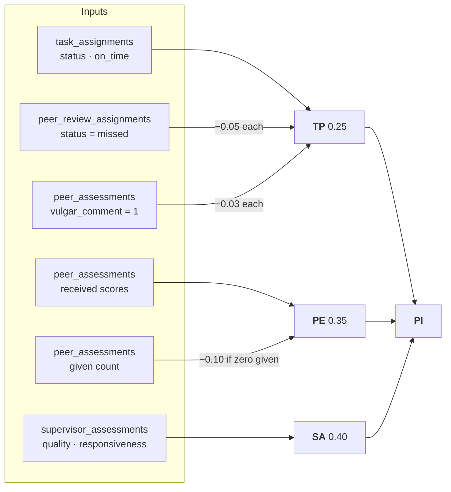
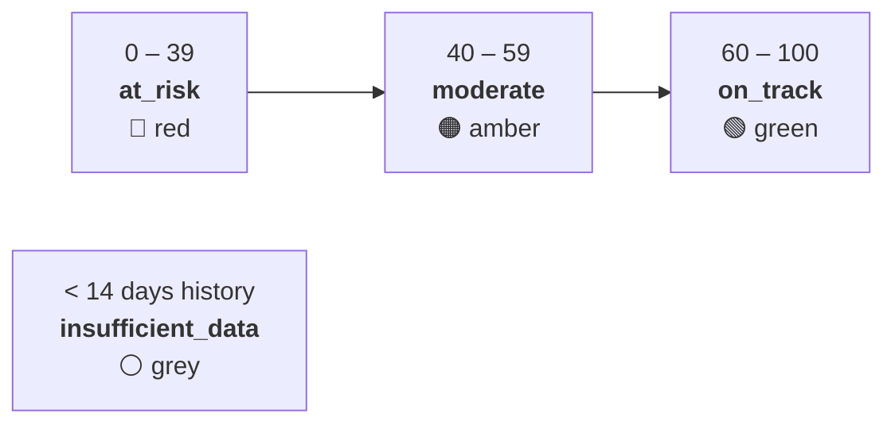
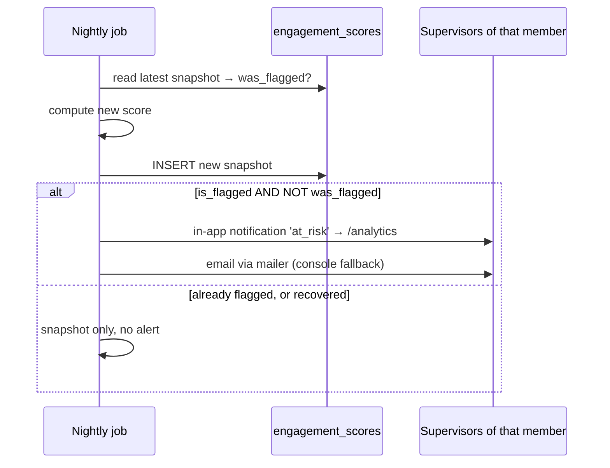

# Scoring Engine

Two independent scores drive every dashboard in the system:

| Score | Range | Answers | Computed in |
| --- | --- | --- | --- |
| **Performance Index (PI)** | 0–1 | *How well is this member performing?* | `services/performance.service.js` |
| **Engagement Score** | 0–100 | *Is this member disengaging?* | `services/engagement.service.js` |

Both are **recomputed live on every read** and *additionally* snapshotted nightly. Every
weight, threshold and penalty comes from `system_settings` (merged over hard-coded defaults),
so an admin can retune the model at `PUT /api/admin/settings` without a restart.

---

## 1. Performance Index

```
PI = w₁·TP + w₂·PE + w₃·SA        clamped to [0, 1]

w₁ = pi_weight_tp  = 0.25   Task Performance
w₂ = pi_weight_pe  = 0.35   Peer Evaluation
w₃ = pi_weight_sa  = 0.40   Supervisor Assessment
```



The weights are **not** validated to sum to 1. They happen to, at the defaults; if an admin
changes them so they don't, the result is simply clamped into `[0, 1]`.

### 1.1 TP — Task Performance

```
timeliness = on_time_completions / total_completions       (0 if nothing completed)
base_TP    = (completed / total_assigned) × timeliness
TP         = clamp₀₁( base_TP − reviewer_penalties )

reviewer_penalties = missed_reviews  × peer_review_missed_penalty (0.05)
                   + vulgar_comments × peer_review_bad_penalty    (0.03)
```

TP multiplies **volume by punctuality**, so both matter: finishing everything late scores the
same as finishing nothing. The penalty term is where a member's *reviewer* obligations feed
back into their own task score — miss a peer review deadline and your TP drops, permanently
(missed rows are never cleared).

> ⚠️ `on_time` is stamped only when the member themselves moves the assignment to
> `Completed`. When a supervisor closes it via `mark_completed`, `on_time` stays NULL, so the
> completion counts in the numerator of `completed / total` but not in `timeliness`. See
> gap #4 in [ARCHITECTURE.md](./ARCHITECTURE.md#11-known-gaps-and-technical-debt).

### 1.2 PE — Peer Evaluation

```
PR_component = (Σ peer_review_scores  / (5 × k)) × 0.5      k = reviews received
CO_component = (Σ collaboration_scores / (5 × m)) × 0.5     m = ratings received
PE           = clamp₀₁( PR_component + CO_component − skip_penalty )

skip_penalty = peer_penalty (0.10) when a cohort exists and the member has
               written zero assessments of any kind; otherwise 0
```

Peer review (submission-triggered, cross-team) and collaboration (self-initiated,
same-team) each contribute **half**. A member with excellent peer reviews but no
collaboration ratings caps out at PE = 0.5.

The skip penalty is deliberately blunt: it fires on *zero* given assessments, not on a
ratio. Writing a single review of any kind removes it entirely.

### 1.3 SA — Supervisor Assessment

```
avg_quality        = AVG(quality_score)          0–5, entered by the supervisor
avg_responsiveness = AVG(responsiveness_score)   0–5, derived; falls back to avg_quality
SA                 = clamp₀₁( (avg_quality + avg_responsiveness) / 10 )
```

Responsiveness is only recorded when a submission is a **revision** — it measures how fast
the member turned the revision around:

| Turnaround since `revision_requested_at` | Score |
| --- | --- |
| ≤ 24 hours | 5 |
| ≤ 48 hours | 3 |
| > 48 hours | 1 |

A member who never needed a revision has no responsiveness rows, so the average mirrors
quality — no one is punished for never being asked to revise.

SA carries the largest weight (0.40): supervisor judgment outranks both throughput and peer
opinion.

### 1.4 Worked example

Grace, over her account lifetime:

| Input | Value |
| --- | --- |
| Assignments | 10 total, 8 completed, 6 on time |
| Missed peer reviews | 1 |
| Vulgar comments written | 0 |
| Peer reviews received | 4, scores summing to 16 |
| Collaboration ratings received | 3, summing to 12 |
| Assessments written | 5 (no skip penalty) |
| Supervisor assessments | avg quality 4.0, avg responsiveness 3.0 |

```
timeliness = 6 / 8                       = 0.75
base_TP    = (8 / 10) × 0.75             = 0.60
penalties  = 1 × 0.05 + 0 × 0.03         = 0.05
TP         = 0.60 − 0.05                 = 0.55

PR = (16 / (5 × 4)) × 0.5                = 0.40
CO = (12 / (5 × 3)) × 0.5                = 0.40
PE = 0.40 + 0.40 − 0                     = 0.80

SA = (4.0 + 3.0) / 10                    = 0.70

PI = 0.25×0.55 + 0.35×0.80 + 0.40×0.70
   = 0.1375 + 0.2800 + 0.2800            = 0.6975   → 69.8%
```

That single missed peer review cost her `0.25 × 0.05 = 0.0125` PI — 1.25 points.

### 1.5 Weekly scores are a different formula

`GET /api/analytics/weekly` and the weekly chart on the member detail page do **not** use the
lifetime formula. `computeWeeklyForMember` (`analytics.routes.js:82`) recomputes each
component from that week's rows only, with two deliberate differences:

```
weekly_TP = clamp₀₁( (min(completed, 5) / 5) × (completed ? (timeliness || 0.5) : 0) )
weekly_PE = (avg peer score / 5)×0.5 + (avg collab score / 5)×0.5     (window only)
weekly_SA = (avg quality + (avg responsiveness || avg quality || 0)) / 10
weekly_PI = null when the member had no activity at all that week
```

- There is no denominator of "assigned", so TP is scored against a **fixed target of 5
  completions per week** rather than against the member's own workload.
- Reviewer penalties are **not** applied weekly — they only appear in the lifetime PI.
- `timeliness || 0.5` means a week with completions but **zero** on-time ones scores 0.5
  rather than 0, because `0` is falsy in JavaScript. This mostly papers over NULL `on_time`
  values from supervisor-closed tasks, but it does mean a fully-late week is not scored as
  badly as the lifetime formula would score it.
- Weeks are **Monday-start, UTC** (`weekStartUtc`), and `weeks` is clamped to 4–16.

Treat weekly PI as a *trend indicator*, not a comparable value against the lifetime PI.

---

## 2. Engagement Score

An "ML-style" weighted feature model — three behavioural features over rolling windows, no
trained model or external Python worker. The SRS's ML worker is realised as an isolated
scheduled job instead.

```
score = 0.34 × login_feature + 0.33 × task_feature + 0.33 × submission_feature
```

### 2.1 Cold-start guard

```
history_days = max( days since users.created_at,
                    days since earliest activity_logs row )

if history_days < 14 → { score: null, status: 'insufficient_data' }
```

New accounts are never flagged. In the UI this surfaces as a grey chip, distinct from a real
low score.

### 2.2 Features

| # | Feature | Window | Target (= 100) | Query |
| --- | --- | --- | --- | --- |
| 1 | Distinct days with a `login` event | 14 days | 10 active days | `COUNT(DISTINCT DATE(created_at))` |
| 2 | `task_update` events | 14 days | 7 updates | `COUNT(*)` |
| 3 | Share of submissions not late | 30 days | 100% on time | `SUM(is_late = 0) / COUNT(*)` |

Each is normalised to its target and clamped to `[0, 100]`. Feature 3 scores **0** when there
were no submissions in the window — silence reads as disengagement, not as neutral.

Features 1 and 2 are read from `activity_logs`, which means the score is only as good as the
instrumentation. Currently logged: `login`, `task_update` (status change or task creation),
`submission`, `comment`, `peer_review`.

### 2.3 Status bands

With the default `engagement_risk_threshold = 40`:



The moderate band is hard-coded as `threshold` to `threshold + 20`, so moving the threshold
slides the amber band with it.

### 2.4 Worked example

Kevin, over the last two weeks:

| Feature | Raw | Normalised |
| --- | --- | --- |
| Login days | 7 of a 10-day target | 70.00 |
| Task updates | 5 of a 7 target | 71.43 |
| On-time submissions | 3 of 4 in 30 days | 75.00 |

```
score = 0.34×70.00 + 0.33×71.43 + 0.33×75.00
      = 23.80 + 23.57 + 24.75  = 72.12   → on_track
```

Drop his logins to 2 days and his updates to 1:

```
score = 0.34×20.00 + 0.33×14.29 + 0.33×75.00
      = 6.80 + 4.71 + 24.75    = 36.26   → at_risk 🔴
```

### 2.5 Alerting

`recomputeAllEngagement()` compares against the member's **previous** snapshot and only
alerts on a *newly* flagged member:



This prevents a permanently-disengaged member from generating a nightly email to every
supervisor. It also means **recovery is silent** — nobody is told when someone climbs back
above the threshold.

---

## 3. Peer-reviewer assignment

When a submission lands, up to `PEER_REVIEWERS_PER_SUBMISSION` (default 3, hard-clamped to
1–3) reviewers are drawn from **all active members except the author** — system-wide, not
team-scoped. This is deliberate: peer review is cross-team, collaboration ratings are
in-team.

Selection is weighted-random without replacement, one slot at a time:

```
engagement_factor = (100 − engagement_score) / 100 + 0.15
workload_factor   = (cap − pending_reviews + 1) / (cap + 1)      cap = max(2×maxReviewers, 6)
jitter            = 0.85 + random()×0.30
weight            = max(0.01, engagement_factor × workload_factor × jitter)
```

Then roulette-wheel selection over the weights.

| Term | Effect | Why |
| --- | --- | --- |
| `engagement_factor` | **Lower** engagement → **higher** weight | Reviewing is participation. Giving disengaged members work is an intervention, not a punishment. The `+ 0.15` floor keeps a perfectly-engaged member (score 100) selectable at weight 0.15 rather than 0. |
| `workload_factor` | More pending reviews → lower weight | Spreads load. At `pending = cap` the factor is `1/(cap+1)` — small but non-zero, so there is no hard cap. |
| `jitter` | ±15% noise | Prevents deterministic, predictable pairings when scores are tied |

A member with no engagement snapshot has one computed live; if that is still unavailable the
neutral default `50` is used.

Each selected reviewer gets a `peer_review_assignments` row due in
`peer_review_deadline_days` (default 7) and a `peer_assignment` notification. Supervisors see
the resulting distribution — assigned / completed / pending / missed per reviewer, alongside
engagement — at `GET /api/analytics/peer-assignments`.

---

## 4. Penalty catalogue

Every way a score can be reduced, in one place:

| Penalty | Amount | Applies to | Trigger | Reversible? |
| --- | --- | --- | --- | --- |
| Missed peer review | `−0.05` TP each | The **reviewer** | `pending` assignment past `due_at` when the nightly job runs | ❌ Never cleared |
| Vulgar comment | `−0.03` TP each | The comment's **author** | `utils/profanity.js` word-boundary match at write time | ⚠️ Only by editing the review to remove the language (upsert resets the flag) |
| No peer duty | `−0.10` PE | The **member** | Zero assessments written while a cohort exists | ✅ Write one review of any kind |
| Late submission | indirect | The **member** | `is_late = 1` lowers engagement feature 3 | ✅ Rolls out of the 30-day window |
| Late completion | indirect | The **member** | `on_time = 0` lowers `timeliness`, which multiplies TP | ❌ Lifetime ratio |

`penalty_applied` on a performance snapshot is a single boolean, true when *any* of missed
reviews, vulgar comments, or skipped peer duty applies. The detailed breakdown is returned
live under `reviewer_penalties` (`missed_reviews`, `vulgar_comments`, `tp_deduction`) plus
`base_tp`, so the UI can show "0.60 → 0.55 (1 missed review)".

### Profanity detection

`utils/profanity.js` normalises the comment (lowercase, strip non-alphanumerics, collapse
whitespace) then matches a fixed list of ~25 terms on **word boundaries** — so "assessment"
does not match "ass". Multi-word phrases are matched as substrings. It is a deliberate
blunt instrument: no leetspeak handling, no ML classifier, no appeals workflow. Supervisors
can see the `vulgar_comment` flag on any review via `/api/analytics/peer-reviews`.

---

## 5. When scores are computed

| Trigger | What runs | Persisted? |
| --- | --- | --- |
| Any analytics read | `computePerformanceForMember`, `computeEngagementForMember` | No — live only |
| Member submits a peer review | `recomputePerformanceForMember` for the reviewer | ✅ `performance_scores` |
| Nightly cron (`SCORING_CRON`, default `0 2 * * *`) | Mark overdue → recompute all performance → recompute all engagement + alerts | ✅ Both tables |
| `POST /api/analytics/recompute` | Identical to the cron body | ✅ Both tables |
| `npm --prefix server run jobs:run` | Performance + engagement only — **skips** marking overdue reviews | ✅ Both tables |

Because reads always recompute, the snapshot tables are currently a write-only historical
trail. `engagement_scores` has three real consumers (previous-flag comparison, team overview,
reviewer weighting); `performance_scores` has none.

---

## 6. Tuning guide

All of these are live-editable at `PUT /api/admin/settings` and take effect on the next read.

| You want to… | Change |
| --- | --- |
| Value supervisor judgment over peer opinion | Raise `pi_weight_sa`, lower `pi_weight_pe` |
| Make throughput matter more | Raise `pi_weight_tp` |
| Flag more members as at-risk | Raise `engagement_risk_threshold` (also slides the amber band up) |
| Stop punishing quiet weeks | Lower `eng_weight_submission`, raise `eng_weight_login` |
| Give reviewers more slack | Raise `peer_review_deadline_days` |
| Soften reviewer accountability | Lower `peer_review_missed_penalty` |
| Change reviewers per submission | `PEER_REVIEWERS_PER_SUBMISSION` in `.env` (**restart required**, clamped to 1–3) |

Two caveats when retuning:

1. Weights are **not** normalised. If you set all three PI weights to 1.0, every member with
   any activity pins at PI = 1.0 after clamping.
2. Penalty counts are cumulative over a member's lifetime. Lowering
   `peer_review_missed_penalty` reduces the deduction retroactively for everyone, because the
   multiplication happens at read time against the stored `missed` count.
